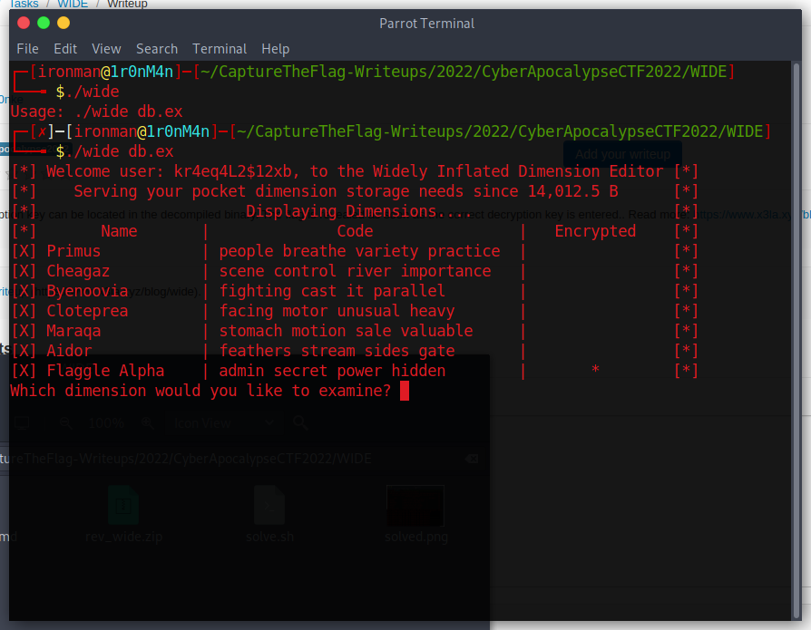
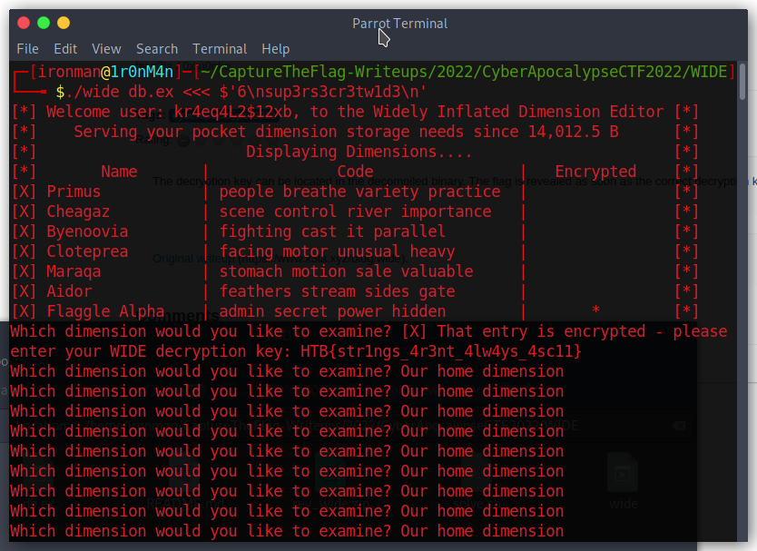

# WIDE

## The Problem


Attachments : [rev_wide.zip](rev_wide.zip)


## Solution

the provided app is executible and looking for input:



strings wide didnt reveal the string eval

opening the source shows the app is looking for a string input. This is applied like this: 

[solve.sh](solve.sh)

```
./wide db.ex <<< $'6\nsup3rs3cr3tw1d3\n'
```



## Flag
```
HTB{str1ngs_4r3nt_4lw4ys_4sc11}

```

## Final Notes
