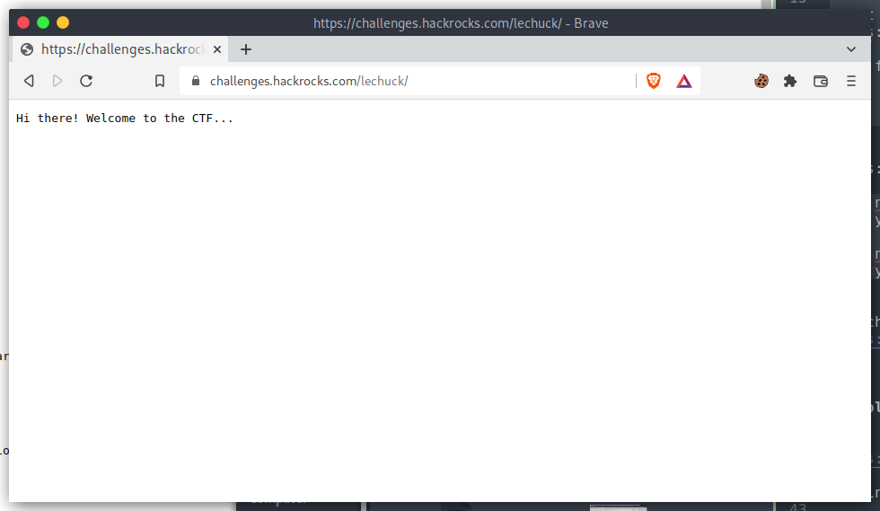
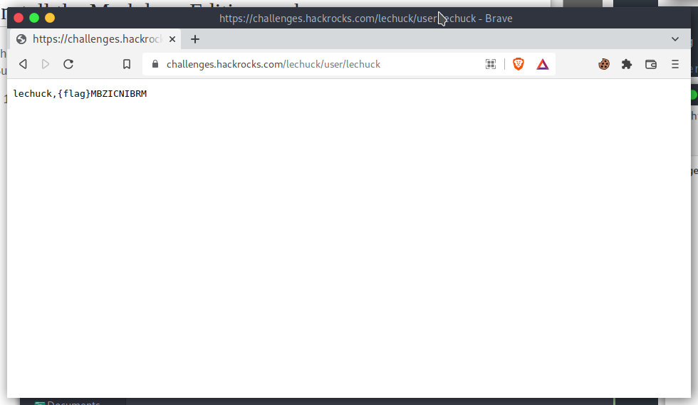

# LeChuck is back!

## The Problem

Points: 35 Points

Rating:EASY

Author:

Flavor Text:
```

Where could they have started? Your instinct warns you: LeChuck has a big ego, and he's probably left his signature somewhere on your site. 

Is it that easy? Bingo! Something pops up at that URL https://challenges.hackrocks.com/lechuck

Look for LeChuck's footprints to move on!


```

Clues:
```
Clue nº 1
Have you searched for common endpoints?

Clue nº 2
Have you found the /user endpoint yet?
```

Attachments : [https://challenges.hackrocks.com/lechuck](https://challenges.hackrocks.com/lechuck)


## Solution


https://challenges.hackrocks.com/lechuck/

Nothing to see here...


https://raw.githubusercontent.com/mazen160/SecLists/7bbc06c6e2be9799cbab6c67f101e5b10b61edc2/Discovery/Web_Content/MAZEN160_COMMON_API_ENDPOINTS.txt


this endpoints shows the user endpoint and that seems to respond only with :




using the hint we find user

v


lets use admin, 1 administrator etc. finally 

lechuck worked

https://challenges.hackrocks.com/lechuck/user/lechuck



## Flag
```

MBZICNIBRM

```

## Final Notes

really dumb...