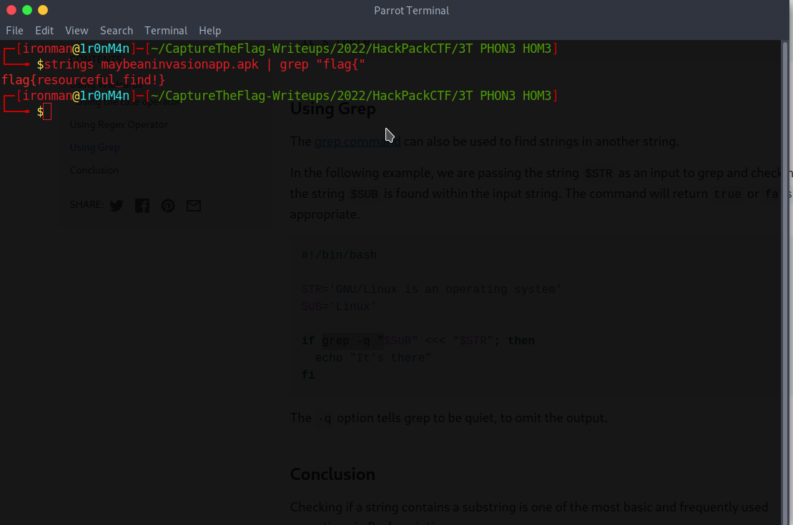

# 3T PHON3 HOM3

Points: 100

Rating: easy 

Author: kiwi

Flavor Text:
```
ET has somehow nabbed a flip phone, and is communicating with his alien friends in outer space in order to (we suspect) utterly subjugate humanity. He's doing this through a weird operating system called "Android", and it has "apps"???

It's 1982, so no one has any idea what kind of newfangled technology he's using. Thankfully, you're a visitor from the future. In 2022, everyone knows how to be resourceful and reverse android applications. Find the hidden date that ET plans to conquer the world, so we can be prepared.
```

Attachments : [maybeaninvasionapp.apk](maybeaninvasionapp.apk)


## Solution

downloaded the provided sourcefile. 

ran strings on it and searched it for 'flag{'



```
strings maybeaninvasionapp.apk | grep "flag{"

```

## Flag
```
flag{resourceful_find!}
```


## Final Notes

This one was a very easy task with the twist being an android file rather than the usual c binary. this task did kick off a much harder one that required an android capible tool.

Part two: 
[3T_3ND_UR_HOM3](../3T_3ND_UR_HOM3)

