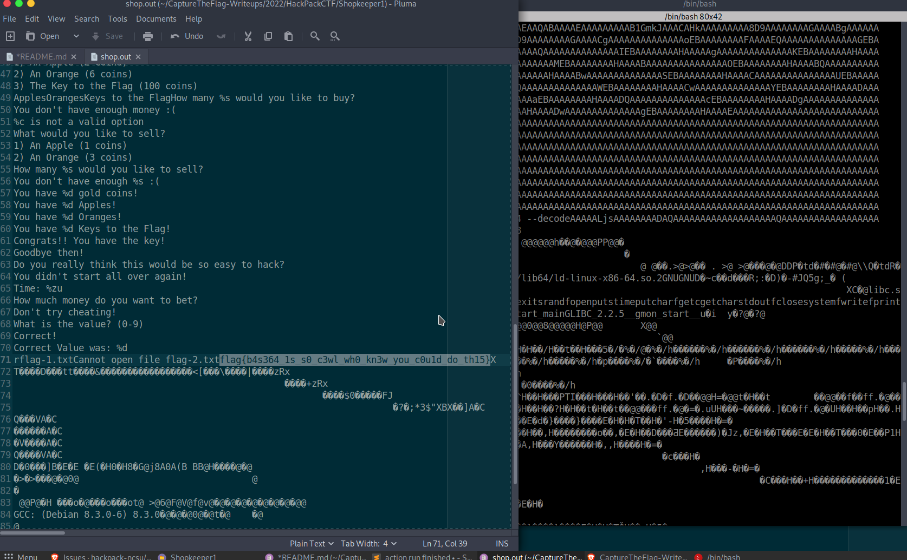

# Shopkeeper 1

## The Problem

Points: 100

Rating: easy

Author: Abraxus

Flavor Text:
```
When I connect I get some weird text before the program starts running, I wonder what could be hidden in it.

nc cha.hackpack.club 10992
```


## Solution


When opening the provided terminal connection we get a dump in base64 and then the shop cli. 


```
f0VMRgIBAQAAAAAAAAAAAAIAPgABAAAAEBFAAAAAAABAAAAAAAAAADg8AAAAAAAAAAAAAEAAOAAL
AEAAHQAcAAYAAAAEAAAAQAAAAAAAAABAAEAAAAAAAEAAQAAAAAAAaAIAAAAAAABoAgAAAAAAAAgA
AAAAAAAAAwAAAAQAAACoAgAAAAAAAKgCQAAAAAAAqAJAAAAAAAAcAAAAAAAAABwAAAAAAAAAAQAA
AAAAAAABAAAABAAAAAAAAAAAAAAAAABAAAAAAAAAAEAAAAAAAFAHAAAAAAAAUAcAAAAAAAAAEAAA
AAAAAAEAAAAFAAAAABAAAAAAAAAAEEAAAAAAAAAQQAAAAAAA7QsAAAAAAADtCwAAAAAAAAAQAAAA
AAAAAQAAAAQAAAAAIAAAAAAAAAAgQAAAAAAAACBAAAAAAACoBQAAAAAAAKgFAAAAAAAAABAAAAAA
AAABAAAABgAAABAuAAAAAAAAED5AAAAAAAAQPkAAAAAAAIkCAAAAAAAAoAIAAAAAAAAAEAAAAAAA
AAIAAAAGAAAAIC4AAAAAAAAgPkAAAAAAACA+QAAAAAAA0AEAAAAAAADQAQAAAAAAAAgAAAAAAAAA
BAAAAAQAAADEAgAAAAAAAMQCQAAAAAAAxAJAAAAAAABEAAAAAAAAAEQAAAAAAAAABAAAAAAAAABQ
5XRkBAAAAMwjAAAAAAAAzCNAAAAAAADMI0AAAAAAAFwAAAAAAAAAXAAAAAAAAAAEAAAAAAAAAFHl
dGQHAAAAAAAAAAAAAAAAAAAAAAAAAAAAAAAAAAAAAAAAAAAAAAAAAAAAAAAAABAAAAAAAAAAUuV0
ZAQAAAAQLgAAAAAAABA+QAAAAAAAED5AAAAAAADwAQAAAAAAAPABAAAAAAAAAQAAAAAAAAAvbGli
NjQvbGQtbGludXgteDg2LTY0LnNvLjIABAAAABAAAAABAAAAR05VAAAAAAADAAAAAgAAAAAAAAAE
AAAAFAAAAAMAAABHTlUARNd+Y8jcZOOTEoAAzxNSOwI6nUQCAAAAEQAAAAEAAAAGAAAAAAAAAAAB
EAARAAAAAAAAACkdjBwAAAAAAAAAAAAAAAAAAAAAAAAAAAAAAAAAAAAALQAAABIAAAAAAAAAAAAA
AAAAAAAAAAAAIwAAABIAAAAAAAAAAAAAAAAAAAAAAAAASgAAABIAAAAAAAAAAAAAAAAAAAAAAAAA
UQAAABIAAAAAAAAAAAAAAAAAAAAAAAAANQAAABIAAAAAAAAAAAAAAAAAAAAAAAAAZwAAABIAAAAA
AAAAAAAAAAAAAAAAAAAAFwAAABIAAAAAAAAAAAAAAAAAAAAAAAAAOwAAABIAAAAAAAAAAAAAAAAA
AAAAAAAAXwAAABIAAAAAAAAAAAAAAAAAAAAAAAAAhQAAACAAAAAAAAAAAAAAAAAAAAAAAAAAKAAA
ABIAAAAAAAAAAAAAAAAAAAAAAAAACwAAABIAAAAAAAAAAAAAAAAAAAAAAAAAHQAAABIAAAAAAAAA
AAAAAAAAAAAAAAAAEgAAABIAAAAAAAAAAAAAAAAAAAAAAAAAWAAAABIAAAAAAAAAAAAAAAAAAAAA
AAAAGAAAABIAAAAAAAAAAAAAAAAAAAAAAAAAQwAAABEAGACgQEAAAAAAAAgAAAAAAAAAAGxpYmMu
c28uNgBmZmx1c2gAZXhpdABzcmFuZABmb3BlbgBwdXRzAHRpbWUAcHV0Y2hhcgBmZ2V0YwBnZXRj
aGFyAHN0ZG91dABmY2xvc2UAc3lzdGVtAGZ3cml0ZQBmcHJpbnRmAF9fbGliY19zdGFydF9tYWlu
AEdMSUJDXzIuMi41AF9fZ21vbl9zdGFydF9fAAAAAgACAAIAAgACAAIAAgACAAIAAAACAAIAAgAC
AAIAAgACAAEAAQABAAAAEAAAAAAAAAB1GmkJAAACAHkAAAAAAAAA8D9AAAAAAAAGAAAABgAAAAAA
AAAAAAAA+D9AAAAAAAAGAAAACgAAAAAAAAAAAAAAoEBAAAAAAAAFAAAAEQAAAAAAAAAAAAAAGEBA
AAAAAAAHAAAAAQAAAAAAAAAAAAAAIEBAAAAAAAAHAAAAAgAAAAAAAAAAAAAAKEBAAAAAAAAHAAAA
AwAAAAAAAAAAAAAAMEBAAAAAAAAHAAAABAAAAAAAAAAAAAAAOEBAAAAAAAAHAAAABQAAAAAAAAAA
AAAAQEBAAAAAAAAHAAAABwAAAAAAAAAAAAAASEBAAAAAAAAHAAAACAAAAAAAAAAAAAAAUEBAAAAA
AAAHAAAACQAAAAAAAAAAAAAAWEBAAAAAAAAHAAAACwAAAAAAAAAAAAAAYEBAAAAAAAAHAAAADAAA
AAAAAAAAAAAAaEBAAAAAAAAHAAAADQAAAAAAAAAAAAAAcEBAAAAAAAAHAAAADgAAAAAAAAAAAAAA
eEBAAAAAAAAHAAAADwAAAAAAAAAAAAAAgEBAAAAAAAAHAAAAEAAAAAAAAAAAAAAAAAAAAAAAAAAA
AAAAAAAAAAAAAAAAAAAAAAAAAAAAAAAAAAAAAAAAAAAAAAAAAAAAAAAAAAAAAAAAAAAAAAAAAAAA
AAAAAAAAAAAAAAAAAAAAAAAAAAAAAAAAAAAAAAAAAAAAAAAAAAAAAAAAAAAAAAAAAAAAAAAAAAAA
AAAAAAAAAAAAAAAAAAAAAAAAAAAAAAAAAAAAAAAAAAAAAAAAAAAAAAAAAAAAAAAAAAAAAAAAAAAA
AAAAAAAAAAAAAAAAAAAAAAAAAAAAAAAAAAAAAAAAAAAAAAAAAAAAAAAAAAAAAAAAAAAAAAAAAAAA
AAAAAAAAAAAAAAAAAAAAAAAAAAAAAAAAAAAAAAAAAAAAAAAAAAAAAAAAAAAAAAAAAAAAAAAAAAAA
AAAAAAAAAAAAAAAAAAAAAAAAAAAAAAAAAAAAAAAAAAAAAAAAAAAAAAAAAAAAAAAAAAAAAAAAAAAA
AAAAAAAAAAAAAAAAAAAAAAAAAAAAAAAAAAAAAAAAAAAAAAAAAAAAAAAAAAAAAAAAAAAAAAAAAAAA
AAAAAAAAAAAAAAAAAAAAAAAAAAAAAAAAAAAAAAAAAAAAAAAAAAAAAAAAAAAAAAAAAAAAAAAAAAAA
AAAAAAAAAAAAAAAAAAAAAAAAAAAAAAAAAAAAAAAAAAAAAAAAAAAAAAAAAAAAAAAAAAAAAAAAAAAA
AAAAAAAAAAAAAAAAAAAAAAAAAAAAAAAAAAAAAAAAAAAAAAAAAAAAAAAAAAAAAAAAAAAAAAAAAAAA
AAAAAAAAAAAAAAAAAAAAAAAAAAAAAAAAAAAAAAAAAAAAAAAAAAAAAAAAAAAAAAAAAAAAAAAAAAAA
AAAAAAAAAAAAAAAAAAAAAAAAAAAAAAAAAAAAAAAAAAAAAAAAAAAAAAAAAAAAAAAAAAAAAAAAAAAA
AAAAAAAAAAAAAAAAAAAAAAAAAAAAAAAAAAAAAAAAAAAAAAAAAAAAAAAAAAAAAAAAAAAAAAAAAAAA
AAAAAAAAAAAAAAAAAAAAAAAAAAAAAAAAAAAAAAAAAAAAAAAAAAAAAAAAAAAAAAAAAAAAAAAAAAAA
AAAAAAAAAAAAAAAAAAAAAAAAAAAAAAAAAAAAAAAAAAAAAAAAAAAAAAAAAAAAAAAAAAAAAAAAAAAA
AAAAAAAAAAAAAAAAAAAAAAAAAAAAAAAAAAAAAAAAAAAAAAAAAAAAAAAAAAAAAAAAAAAAAAAAAAAA
AAAAAAAAAAAAAAAAAAAAAAAAAAAAAAAAAAAAAAAAAAAAAAAAAAAAAAAAAAAAAAAAAAAAAAAAAAAA
AAAAAAAAAAAAAAAAAAAAAAAAAAAAAAAAAAAAAAAAAAAAAAAAAAAAAAAAAAAAAAAAAAAAAAAAAAAA
AAAAAAAAAAAAAAAAAAAAAAAAAAAAAAAAAAAAAAAAAAAAAAAAAAAAAAAAAAAAAAAAAAAAAAAAAAAA
AAAAAAAAAAAAAAAAAAAAAAAAAAAAAAAAAAAAAAAAAAAAAAAAAAAAAAAAAAAAAAAAAAAAAAAAAAAA
AAAAAAAAAAAAAAAAAAAAAAAAAAAAAAAAAAAAAAAAAAAAAAAAAAAAAAAAAAAAAAAAAAAAAAAAAAAA
AAAAAAAAAAAAAAAAAAAAAAAAAAAAAAAAAAAAAAAAAAAAAAAAAAAAAAAAAAAAAAAAAAAAAAAAAAAA
AAAAAAAAAAAAAAAAAAAAAAAAAAAAAAAAAAAAAAAAAAAAAAAAAAAAAAAAAAAAAAAAAAAAAAAAAAAA
AAAAAAAAAAAAAAAAAAAAAAAAAAAAAAAAAAAAAAAAAAAAAAAAAAAAAAAAAAAAAAAAAAAAAAAAAAAA
AAAAAAAAAAAAAAAAAAAAAAAAAAAAAAAAAAAAAAAAAAAAAAAAAAAAAAAAAAAAAAAAAAAAAAAAAAAA
AAAAAAAAAAAAAAAAAAAAAAAAAAAAAAAAAAAAAAAAAAAAAAAAAAAAAAAAAAAAAAAAAAAAAAAAAAAA
AAAAAAAAAAAAAAAAAAAAAAAAAAAAAAAAAAAAAAAAAAAAAAAAAAAAAAAAAAAAAAAAAAAAAAAAAAAA
AAAAAAAAAAAAAAAAAAAAAAAAAAAAAAAAAAAAAAAAAAAAAAAAAAAAAAAAAAAAAAAAAAAAAAAAAAAA
AAAAAAAAAAAAAAAAAAAAAAAAAAAAAAAAAAAAAAAAAAAAAAAAAAAAAAAAAAAAAAAAAAAAAAAAAAAA
AAAAAAAAAAAAAAAAAAAAAAAAAAAAAAAAAAAAAAAAAAAAAAAAAAAAAAAAAAAAAAAAAAAAAAAAAAAA
AAAAAAAAAAAAAAAAAAAAAAAAAAAAAAAAAAAAAAAAAAAAAAAAAAAAAAAAAAAAAAAAAAAAAAAAAAAA
AAAAAAAAAAAAAAAAAAAAAAAAAAAAAAAAAAAAAAAAAAAAAAAAAAAAAAAAAAAAAAAAAAAAAAAAAAAA
AAAAAAAAAAAAAAAAAAAAAAAAAAAAAAAAAAAAAAAAAAAAAAAAAAAAAAAAAAAAAAAAAAAAAAAAAAAA
AAAAAAAAAAAAAAAAAAAAAAAAAAAAAAAAAAAAAAAAAAAAAAAAAAAAAAAAAAAAAAAAAAAAAAAAAAAA
AAAAAAAAAAAAAAAAAAAAAAAAAAAAAAAAAAAAAAAAAAAAAAAAAAAAAAAAAAAAAAAAAAAAAAAAAAAA
AAAAAAAAAAAAAAAAAAAAAAAAAAAAAAAAAAAAAAAAAAAAAAAAAAAAAAAAAAAAAAAAAAAAAAAAAAAA
AAAAAAAAAAAAAAAAAAAAAAAAAAAAAAAAAAAAAAAAAAAAAAAAAAAAAAAAAAAAAAAAAAAAAAAAAAAA
AAAAAAAAAAAAAAAAAAAAAAAAAAAAAAAAAAAAAAAAAAAAAAAAAAAAAAAAAAAAAAAAAAAAAAAAAAAA
AAAAAAAAAAAAAAAAAAAAAAAAAAAAAAAAAAAAAAAAAAAAAAAAAAAAAAAAAAAAAAAAAEiD7AhIiwXt
LwAASIXAdAL/0EiDxAjDAAAAAAAAAAAA/zXiLwAA/yXkLwAADx9AAP8l4i8AAGgAAAAA6eD/////
JdovAABoAQAAAOnQ/////yXSLwAAaAIAAADpwP////8lyi8AAGgDAAAA6bD/////JcIvAABoBAAA
AOmg/////yW6LwAAaAUAAADpkP////8lsi8AAGgGAAAA6YD/////JaovAABoBwAAAOlw/////yWi
LwAAaAgAAADpYP////8lmi8AAGgJAAAA6VD/////JZIvAABoCgAAAOlA/////yWKLwAAaAsAAADp
MP////8lgi8AAGgMAAAA6SD/////JXovAABoDQAAAOkQ////Me1JidFeSIniSIPk8FBUScfA4BtA
AEjHwYAbQABIx8cnG0AA/xW2LgAA9A8fRAAAw2YuDx+EAAAAAAAPH0QAALigQEAASD2gQEAAdBO4
AAAAAEiFwHQJv6BAQAD/4GaQw2ZmLg8fhAAAAAAADx9AAL6gQEAASIHuoEBAAEjB/gNIifBIweg/
SAHGSNH+dBG4AAAAAEiFwHQHv6BAQAD/4MNmZi4PH4QAAAAAAA8fQACAPeEuAAAAdRdVSInl6H7/
///GBc8uAAABXcMPH0QAAMNmZi4PH4QAAAAAAA8fQADrjlVIieVIg+xwSIsFny4AAEiJwbovAAAA
vgEAAABIjT3zDQAA6Nb+//9IiwV/LgAASInH6Jf+///GRf8Bx0XgAAAAAMdF5AAAAADHRegAAAAA
6fcEAABIiwVSLgAASInBujQAAAC+AQAAAEiNPdYNAADoif7//0iLBTIuAABIicfoSv7//+gV/v//
iEX+6A3+//8PvkX+g/gyD4TdAQAAg/gyfxOD+P8PhGcEAACD+DF0HOlnBAAAg/gzD4RQAwAAg/g0
D4QWBAAA6VAEAABIiwXaLQAASInBuhwAAAC+AQAAAEiNPZMNAADoEf7//0iLBbotAABIicG6UAAA
AL4BAAAASI09lg0AAOjx/f//SIsFmi0AAEiJx+iy/f//6H39//+D6DGJRfjocv3//0iNBbwNAABI
iUXASI0FuA0AAEiJRchIjQW1DQAASIlF0MdFtAIAAADHRbgGAAAAx0W8ZAAAAIN9+AAPiNkAAACD
ffgCD4/PAAAAi0X4SJhIi1TFwEiLBSctAABIjTWIDQAASInHuAAAAADoE/3//0iLBQwtAABIicfo
JP3//+jv/P//g+gwiUX06OT8//8PtgXlLAAAD7bQi0X4SJiLRIW0D69F9DnCfTFIiwXSLAAASInB
uh8AAAC+AQAAAEiNPU4NAADoCf3//0iLBbIsAABIicfoyvz//+tvD7YVmSwAAItF+EiYi0SFtInG
i0X0icGJ8A+vwSnCidCIBXosAACLRfhImItUheCLRfQBwotF+EiYiVSF4Oswi0X4jVAxSIsFXCwA
AEiNNQUNAABIice4AAAAAOhI/P//SIsFQSwAAEiJx+hZ/P//kOnRAgAASIsFLCwAAEiJwbodAAAA
vgEAAABIjT3iDAAA6GP8//9IiwUMLAAASInBui0AAAC+AQAAAEiNPeAMAADoQ/z//0iLBewrAABI
icfoBPz//+jP+///g+gxiUXw6MT7//9IjQUODAAASIlFoEiNBQoMAABIiUWox0WYAQAAAMdFnAMA
AACDffAAD4jRAAAAg33wAQ+PxwAAAItF8EiYSItUxaBIiwWLKwAASI01nAwAAEiJx7gAAAAA6Hf7
//9IiwVwKwAASInH6Ij7///oU/v//4PoMIlF7OhI+///i0XwSJiLRIXgOUXsfjaLRfBImEiLVMWg
SIsFOSsAAEiNNW8MAABIice4AAAAAOgl+///SIsFHisAAEiJx+g2+///62+LRfBImItEhZiJwYtF
7InCicgPr8KJwg+2Be4qAAAB0IgF5ioAAItF8EiYi0SF4CtF7InCi0XwSJiJVIXg6zCLRfCNUDFI
iwXIKgAASI01cQsAAEiJx7gAAAAA6LT6//9IiwWtKgAASInH6MX6//+Q6T0BAAAPtgWQKgAAD7bQ
SIsFjioAAEiNNeELAABIice4AAAAAOh6+v//i1XgSIsFcCoAAEiNNdwLAABIice4AAAAAOhc+v//
i1XkSIsFUioAAEiNNdMLAABIice4AAAAAOg++v//i1XoSIsFNCoAAEiNNc0LAABIice4AAAAAOgg
+v//SIsFGSoAAEiJx+gx+v//i0XohcAPjqQAAABIiwX/KQAASInBuh0AAAC+AQAAAEiNPaoLAADo
Nvr//0iLBd8pAABIicfo9/n//7gBAAAA631IiwXJKQAASInBug4AAAC+AQAAAEiNPZILAADoAPr/
/0iLBakpAABIicfowfn//8ZF/wDrOb8BAAAA6NH5//9IiwWKKQAASInBujMAAAC+AQAAAEiNPWYL
AADowfn//0iLBWopAABIicfogvn//4B9/wAPhf/6//+4AAAAAMnDVUiJ5UiD7BAPtgU6KQAAPBN0
OUiLBTcpAABIicG6IQAAAL4BAAAASI09SwsAAOhu+f//SIsFFykAAEiJx+gv+f//uAAAAADpCAIA
AL8AAAAA6Av5//9IiUX4SIsF8CgAAEiLVfhIjTUvCwAASInHuAAAAADo2Pj//0iLRfiJx+it+P//
6bcBAABIiwXBKAAASInBuiMAAAC+AQAAAEiNPQULAADo+Pj//0iLBaEoAABIicfoufj//+iE+P//
iEX3gH33AHk5SIsFhCgAAEiJwboUAAAAvgEAAABIjT3sCgAA6Lv4//9IiwVkKAAASInH6Hz4//+4
AAAAAOlVAQAAD7ZF94PoMIhF9w++VfcPtgU1KAAAD7bAOcJ/BoB99wB5OUiLBSkoAABIicG6FAAA
AL4BAAAASI09kQoAAOhg+P//SIsFCSgAAEiJx+gh+P//uAAAAADp+gAAAEiLBfAnAABIicG6GQAA
AL4BAAAASI09bQoAAOgn+P//SIsF0CcAAEiJx+jo9///6LP3//+D6DCIRfboGPj//4nBumdmZmaJ
yPfqwfoCicjB+B8pwonQiUXwi1XwidDB4AIB0AHAKcGJyIlF8A++RfY5RfB1REiLBXsnAABIicG6
CQAAAL4BAAAASI09EgoAAOiy9///SIsFWycAAEiJx+hz9///D7YVRCcAAA+2RfcB0IgFOCcAAOst
SIsFNycAAItV8EiNNeIJAABIice4AAAAAOgg9///SIsFGScAAEiJx+gx9///D7YFAicAADw3D4U6
/v//uAEAAADJw1VIieVIg+wQuAAAAADoO/j//4TAD4SgAAAASI01pgkAAEiNPaEJAADo/vb//0iJ
RfBIg33wAHUlSI09lQkAAOhX9v//SIsFsCYAAEiJx+jI9v//vwAAAADo3vb//0iLRfBIicfoYvb/
/4hF/+saD75F/4nH6BL2//9Ii0XwSInH6Eb2//+IRf+Aff//deBIi0XwSInH6BH2//+/CgAAAOjn
9f//SIsFUCYAAEiJx+ho9v//uAEAAADrBbgAAAAAycNVSInlSIPsELgAAAAA6Nf8//+EwA+EoAAA
AEiNNeUIAABIjT39CAAA6D32//9IiUXwSIN98AB1JUiNPdQIAADolvX//0iLBe8lAABIicfoB/b/
/78AAAAA6B32//9Ii0XwSInH6KH1//+IRf/rGg++Rf+Jx+hR9f//SItF8EiJx+iF9f//iEX/gH3/
/3XgSItF8EiJx+hQ9f//vwoAAADoJvX//0iLBY8lAABIicfop/X//7gBAAAA6wW4AAAAAMnDVUiJ
5UiD7EBIjUXASLpiYXNlNjQgY0iJEMdACGhhbABIjUXASInH6A31//9IjQU+CAAASIlF+LgAAAAA
6D3+//+EwHQKuAAAAADo8P7//7gAAAAAycMPHwBBV0mJ10FWSYn2QVVBif1BVEyNJXgiAABVSI0t
eCIAAFNMKeVIg+wI6FP0//9Iwf0DdBsx2w8fAEyJ+kyJ9kSJ70H/FNxIg8MBSDnddepIg8QIW11B
XEFdQV5BX8MPHwDDAAAASIPsCEiDxAjDAAAAAAAAAAAAAAAAAAAAAAAAAAAAAAAAAAAAAAAAAAAA
AAAAAAAAAAAAAAAAAAAAAAAAAAAAAAAAAAAAAAAAAAAAAAAAAAAAAAAAAAAAAAAAAAAAAAAAAAAA
AAAAAAAAAAAAAAAAAAAAAAAAAAAAAAAAAAAAAAAAAAAAAAAAAAAAAAAAAAAAAAAAAAAAAAAAAAAA
AAAAAAAAAAAAAAAAAAAAAAAAAAAAAAAAAAAAAAAAAAAAAAAAAAAAAAAAAAAAAAAAAAAAAAAAAAAA
AAAAAAAAAAAAAAAAAAAAAAAAAAAAAAAAAAAAAAAAAAAAAAAAAAAAAAAAAAAAAAAAAAAAAAAAAAAA
AAAAAAAAAAAAAAAAAAAAAAAAAAAAAAAAAAAAAAAAAAAAAAAAAAAAAAAAAAAAAAAAAAAAAAAAAAAA
AAAAAAAAAAAAAAAAAAAAAAAAAAAAAAAAAAAAAAAAAAAAAAAAAAAAAAAAAAAAAAAAAAAAAAAAAAAA
AAAAAAAAAAAAAAAAAAAAAAAAAAAAAAAAAAAAAAAAAAAAAAAAAAAAAAAAAAAAAAAAAAAAAAAAAAAA
AAAAAAAAAAAAAAAAAAAAAAAAAAAAAAAAAAAAAAAAAAAAAAAAAAAAAAAAAAAAAAAAAAAAAAAAAAAA
AAAAAAAAAAAAAAAAAAAAAAAAAAAAAAAAAAAAAAAAAAAAAAAAAAAAAAAAAAAAAAAAAAAAAAAAAAAA
AAAAAAAAAAAAAAAAAAAAAAAAAAAAAAAAAAAAAAAAAAAAAAAAAAAAAAAAAAAAAAAAAAAAAAAAAAAA
AAAAAAAAAAAAAAAAAAAAAAAAAAAAAAAAAAAAAAAAAAAAAAAAAAAAAAAAAAAAAAAAAAAAAAAAAAAA
AAAAAAAAAAAAAAAAAAAAAAAAAAAAAAAAAAAAAAAAAAAAAAAAAAAAAAAAAAAAAAAAAAAAAAAAAAAA
AAAAAAAAAAAAAAAAAAAAAAAAAAAAAAAAAAAAAAAAAAAAAAAAAAAAAAAAAAAAAAAAAAAAAAAAAAAA
AAAAAAAAAAAAAAAAAAAAAAAAAAAAAAAAAAAAAAAAAAAAAAAAAAAAAAAAAAAAAAAAAAAAAAAAAAAA
AAAAAAAAAAAAAAAAAAAAAAAAAAAAAAAAAAAAAAAAAAAAAAAAAAAAAAAAAAAAAAAAAAAAAAAAAAAA
AAAAAAAAAAAAAAAAAAAAAAAAAAAAAAAAAAAAAAAAAAAAAAAAAAAAAAAAAAAAAAAAAAAAAAAAAAAA
AAAAAAAAAAAAAAAAAAAAAAAAAAAAAAAAAAAAAAAAAAAAAAAAAAAAAAAAAAAAAAAAAAAAAAAAAAAA
AAAAAAAAAAAAAAAAAAAAAAAAAAAAAAAAAAAAAAAAAAAAAAAAAAAAAAABAAIAAAAAAFdlbGNvbWUg
dG8gbXkgU2hvcCEKV2hhdCB3b3VsZCB5b3UgbGlrZSB0byBkbz8KADEpIEJ1eQoyKSBTZWxsCjMp
IFZpZXcgWW91ciBJbnZlbnRvcnkKNCkgTGVhdmUgU2hvcAoAV2hhdCB3b3VsZCB5b3UgbGlrZSB0
byBidXk/CgAAAAAAAAAxKSBBbiBBcHBsZSAoMiBjb2lucykKMikgQW4gT3JhbmdlICg2IGNvaW5z
KQozKSBUaGUgS2V5IHRvIHRoZSBGbGFnICgxMDAgY29pbnMpCgBBcHBsZXMAT3JhbmdlcwBLZXlz
IHRvIHRoZSBGbGFnAAAAAAAAAABIb3cgbWFueSAlcyB3b3VsZCB5b3UgbGlrZSB0byBidXk/CgAA
AAAAWW91IGRvbid0IGhhdmUgZW5vdWdoIG1vbmV5IDooCgAlYyBpcyBub3QgYSB2YWxpZCBvcHRp
b24KAFdoYXQgd291bGQgeW91IGxpa2UgdG8gc2VsbD8KADEpIEFuIEFwcGxlICgxIGNvaW5zKQoy
KSBBbiBPcmFuZ2UgKDMgY29pbnMpCgAAAEhvdyBtYW55ICVzIHdvdWxkIHlvdSBsaWtlIHRvIHNl
bGw/CgBZb3UgZG9uJ3QgaGF2ZSBlbm91Z2ggJXMgOigKAFlvdSBoYXZlICVkIGdvbGQgY29pbnMh
CgBZb3UgaGF2ZSAlZCBBcHBsZXMhCgBZb3UgaGF2ZSAlZCBPcmFuZ2VzIQoAAABZb3UgaGF2ZSAl
ZCBLZXlzIHRvIHRoZSBGbGFnIQoAQ29uZ3JhdHMhISBZb3UgaGF2ZSB0aGUga2V5IQoAR29vZGJ5
ZSB0aGVuIQoAAAAAAERvIHlvdSByZWFsbHkgdGhpbmsgdGhpcyB3b3VsZCBiZSBzbyBlYXN5IHRv
IGhhY2s/CgAAAAAAWW91IGRpZG4ndCBzdGFydCBhbGwgb3ZlciBhZ2FpbiEKAFRpbWU6ICV6dQoA
AAAASG93IG11Y2ggbW9uZXkgZG8geW91IHdhbnQgdG8gYmV0PwoARG9uJ3QgdHJ5IGNoZWF0aW5n
IQoAV2hhdCBpcyB0aGUgdmFsdWU/ICgwLTkpCgBDb3JyZWN0IQoAQ29ycmVjdCBWYWx1ZSB3YXM6
ICVkCgByAGZsYWctMS50eHQAQ2Fubm90IG9wZW4gZmlsZSAAZmxhZy0yLnR4dAAAAGZsYWd7YjRz
MzY0XzFzX3MwX2Mzd2xfd2gwX2tuM3dfeW91X2MwdTFkX2RvX3RoMTV9AAABGwM7WAAAAAoAAABU
7P//tAAAAETt//90AAAAdO3//6AAAAAm7v//3AAAAIPz///8AAAA2fX//xwBAACa9v//PAEAAFv3
//9cAQAAtPf//3wBAAAU+P//xAEAABQAAAAAAAAAAXpSAAF4EAEbDAcIkAEHEBAAAAAcAAAAyOz/
/ysAAAAAAAAAFAAAAAAAAAABelIAAXgQARsMBwiQAQAAEAAAABwAAADM7P//AQAAAAAAAAAkAAAA
MAAAAJjr///wAAAAAA4QRg4YSg8LdwiAAD8aOyozJCIAAAAAHAAAAFgAAABC7f//XQUAAABBDhCG
AkMNBgNYBQwHCAAcAAAAeAAAAH/y//9WAgAAAEEOEIYCQw0GA1ECDAcIABwAAACYAAAAtfT//8EA
AAAAQQ4QhgJDDQYCvAwHCAAAHAAAALgAAABW9f//wQAAAABBDhCGAkMNBgK8DAcIAAAcAAAA2AAA
APf1//9WAAAAAEEOEIYCQw0GAlEMBwgAAEQAAAD4AAAAMPb//10AAAAAQg4QjwJFDhiOA0UOII0E
RQ4ojAVIDjCGBkgOOIMHRw5Aag44QQ4wQQ4oQg4gQg4YQg4QQg4IABAAAABAAQAASPb//wEAAAAA
AAAAAAAAAAAAAAAAAAAAAAAAAAAAAAAAAAAAAAAAAAAAAAAAAAAAAAAAAAAAAAAAAAAAAAAAAAAA
AAAAAAAAAAAAAAAAAAAAAAAAAAAAAAAAAAAAAAAAAAAAAAAAAAAAAAAAAAAAAAAAAAAAAAAAAAAA
AAAAAAAAAAAAAAAAAAAAAAAAAAAAAAAAAAAAAAAAAAAAAAAAAAAAAAAAAAAAAAAAAAAAAAAAAAAA
AAAAAAAAAAAAAAAAAAAAAAAAAAAAAAAAAAAAAAAAAAAAAAAAAAAAAAAAAAAAAAAAAAAAAAAAAAAA
AAAAAAAAAAAAAAAAAAAAAAAAAAAAAAAAAAAAAAAAAAAAAAAAAAAAAAAAAAAAAAAAAAAAAAAAAAAA
AAAAAAAAAAAAAAAAAAAAAAAAAAAAAAAAAAAAAAAAAAAAAAAAAAAAAAAAAAAAAAAAAAAAAAAAAAAA
AAAAAAAAAAAAAAAAAAAAAAAAAAAAAAAAAAAAAAAAAAAAAAAAAAAAAAAAAAAAAAAAAAAAAAAAAAAA
AAAAAAAAAAAAAAAAAAAAAAAAAAAAAAAAAAAAAAAAAAAAAAAAAAAAAAAAAAAAAAAAAAAAAAAAAAAA
AAAAAAAAAAAAAAAAAAAAAAAAAAAAAAAAAAAAAAAAAAAAAAAAAAAAAAAAAAAAAAAAAAAAAAAAAAAA
AAAAAAAAAAAAAAAAAAAAAAAAAAAAAAAAAAAAAAAAAAAAAAAAAAAAAAAAAAAAAAAAAAAAAAAAAAAA
AAAAAAAAAAAAAAAAAAAAAAAAAAAAAAAAAAAAAAAAAAAAAAAAAAAAAAAAAAAAAAAAAAAAAAAAAAAA
AAAAAAAAAAAAAAAAAAAAAAAAAAAAAAAAAAAAAAAAAAAAAAAAAAAAAAAAAAAAAAAAAAAAAAAAAAAA
AAAAAAAAAAAAAAAAAAAAAAAAAAAAAAAAAAAAAAAAAAAAAAAAAAAAAAAAAAAAAAAAAAAAAAAAAAAA
AAAAAAAAAAAAAAAAAAAAAAAAAAAAAAAAAAAAAAAAAAAAAAAAAAAAAAAAAAAAAAAAAAAAAAAAAAAA
AAAAAAAAAAAAAAAAAAAAAAAAAAAAAAAAAAAAAAAAAAAAAAAAAAAAAAAAAAAAAAAAAAAAAAAAAAAA
AAAAAAAAAAAAAAAAAAAAAAAAAAAAAAAAAAAAAAAAAAAAAAAAAAAAAAAAAAAAAAAAAAAAAAAAAAAA
AAAAAAAAAAAAAAAAAAAAAAAAAAAAAAAAAAAAAAAAAAAAAAAAAAAAAAAAAAAAAAAAAAAAAAAAAAAA
AAAAAAAAAAAAAAAAAAAAAAAAAAAAAAAAAAAAAAAAAAAAAAAAAAAAAAAAAAAAAAAAAAAAAAAAAAAA
AAAAAAAAAAAAAAAAAAAAAAAAAAAAAAAAAAAAAAAAAAAAAAAAAAAAAAAAAAAAAAAAAAAAAAAAAAAA
AAAAAAAAAAAAAAAAAAAAAAAAAAAAAAAAAAAAAAAAAAAAAAAAAAAAAAAAAAAAAAAAAAAAAAAAAAAA
AAAAAAAAAAAAAAAAAAAAAAAAAAAAAAAAAAAAAAAAAAAAAAAAAAAAAAAAAAAAAAAAAAAAAAAAAAAA
AAAAAAAAAAAAAAAAAAAAAAAAAAAAAAAAAAAAAAAAAAAAAAAAAAAAAAAAAAAAAAAAAAAAAAAAAAAA
AAAAAAAAAAAAAAAAAAAAAAAAAAAAAAAAAAAAAAAAAAAAAAAAAAAAAAAAAAAAAAAAAAAAAAAAAAAA
AAAAAAAAAAAAAAAAAAAAAAAAAAAAAAAAAAAAAAAAAAAAAAAAAAAAAAAAAAAAAAAAAAAAAAAAAAAA
AAAAAAAAAAAAAAAAAAAAAAAAAAAAAAAAAAAAAAAAAAAAAAAAAAAAAAAAAAAAAAAAAAAAAAAAAAAA
AAAAAAAAAAAAAAAAAAAAAAAAAAAAAAAAAAAAAAAAAAAAAAAAAAAAAAAAAAAAAAAAAAAAAAAAAAAA
AAAAAAAAAAAAAAAAAAAAAAAAAAAAAAAAAAAAAAAAAAAAAAAAAAAAAAAAAAAAAAAAAAAAAAAAAAAA
AAAAAAAAAAAAAAAAAAAAAAAAAAAAAAAAAAAAAAAAAAAAAAAAAAAAAAAAAAAAAAAAAAAAAAAAAAAA
AAAAAAAAAAAAAAAAAAAAAAAAAAAAAAAAAAAAAAAAAAAAAAAAAAAAAAAAAAAAAAAAAAAAAAAAAAAA
AAAAAAAAAAAAAAAAAAAAAAAAAAAAAAAAAAAAAAAAAAAAAAAAAAAAAAAAAAAAAAAAAAAAAAAAAAAA
AAAAAAAAAAAAAAAAAAAAAAAAAAAAAAAAAAAAAAAAAAAAAAAAAAAAAAAAAAAAAAAAAAAAAAAAAAAA
AAAAAAAAAAAAAAAAAAAAAAAAAAAAAAAAAAAAAAAAAAAAAAAAAAAAAAAAAAAAAAAAAAAAAAAAAAAA
AAAAAAAAAAAAAAAAAAAAAAAAAAAAAAAAAAAAAAAAAAAAAAAAAAAAAAAAAAAAAAAAAAAAAAAAAAAA
AAAAAAAAAAAAAAAAAAAAAAAAAAAAAAAAAAAAAAAAAAAAAAAAAAAAAAAAAAAAAAAAAAAAAAAAAAAA
AAAAAAAAAAAAAAAAAAAAAAAAAAAAAAAAAAAAAAAAAAAAAAAAAAAAAAAAAAAAAAAAAAAAAAAAAAAA
AAAAAAAAAAAAAAAAAAAAAAAAAAAAAAAAAAAAAAAAAAAAAAAAAAAAAAAAAAAAAAAAAAAAAAAAAAAA
AAAAAAAAAAAAAAAAAAAAAAAAAAAAAAAAAAAAAAAAAAAAAAAAAAAAAAAAAAAAAAAAAAAAAAAAAAAA
AAAAAAAAAAAAAAAAAAAAAAAAAAAAAAAAAAAAAAAAAAAAAAAAAAAAAAAAAAAAAAAAAADwEUAAAAAA
AMARQAAAAAAAAQAAAAAAAAABAAAAAAAAAAwAAAAAAAAAABBAAAAAAAANAAAAAAAAAOQbQAAAAAAA
GQAAAAAAAAAQPkAAAAAAABsAAAAAAAAACAAAAAAAAAAaAAAAAAAAABg+QAAAAAAAHAAAAAAAAAAI
AAAAAAAAAPX+/28AAAAACANAAAAAAAAFAAAAAAAAAOAEQAAAAAAABgAAAAAAAAAwA0AAAAAAAAoA
AAAAAAAAlAAAAAAAAAALAAAAAAAAABgAAAAAAAAAFQAAAAAAAAAAAAAAAAAAAAMAAAAAAAAAAEBA
AAAAAAACAAAAAAAAAFABAAAAAAAAFAAAAAAAAAAHAAAAAAAAABcAAAAAAAAAAAZAAAAAAAAHAAAA
AAAAALgFQAAAAAAACAAAAAAAAABIAAAAAAAAAAkAAAAAAAAAGAAAAAAAAAD+//9vAAAAAJgFQAAA
AAAA////bwAAAAABAAAAAAAAAPD//28AAAAAdAVAAAAAAAAAAAAAAAAAAAAAAAAAAAAAAAAAAAAA
AAAAAAAAAAAAAAAAAAAAAAAAAAAAAAAAAAAAAAAAAAAAAAAAAAAAAAAAAAAAAAAAAAAAAAAAAAAA
AAAAAAAAAAAAAAAAAAAAAAAAAAAAAAAAAAAAAAAAAAAAID5AAAAAAAAAAAAAAAAAAAAAAAAAAAAA
NhBAAAAAAABGEEAAAAAAAFYQQAAAAAAAZhBAAAAAAAB2EEAAAAAAAIYQQAAAAAAAlhBAAAAAAACm
EEAAAAAAALYQQAAAAAAAxhBAAAAAAADWEEAAAAAAAOYQQAAAAAAA9hBAAAAAAAAGEUAAAAAAAAAA
AAAAAAAAAAAAAAAAAAAKR0NDOiAoRGViaWFuIDguMy4wLTYpIDguMy4wAAAAAAAAAAAAAAAAAAAA
AAAAAAAAAAAAAAAAAAAAAAADAAEAqAJAAAAAAAAAAAAAAAAAAAAAAAADAAIAxAJAAAAAAAAAAAAA
AAAAAAAAAAADAAMA5AJAAAAAAAAAAAAAAAAAAAAAAAADAAQACANAAAAAAAAAAAAAAAAAAAAAAAAD
AAUAMANAAAAAAAAAAAAAAAAAAAAAAAADAAYA4ARAAAAAAAAAAAAAAAAAAAAAAAADAAcAdAVAAAAA
AAAAAAAAAAAAAAAAAAADAAgAmAVAAAAAAAAAAAAAAAAAAAAAAAADAAkAuAVAAAAAAAAAAAAAAAAA
AAAAAAADAAoAAAZAAAAAAAAAAAAAAAAAAAAAAAADAAsAABBAAAAAAAAAAAAAAAAAAAAAAAADAAwA
IBBAAAAAAAAAAAAAAAAAAAAAAAADAA0AEBFAAAAAAAAAAAAAAAAAAAAAAAADAA4A5BtAAAAAAAAA
AAAAAAAAAAAAAAADAA8AACBAAAAAAAAAAAAAAAAAAAAAAAADABAAzCNAAAAAAAAAAAAAAAAAAAAA
AAADABEAKCRAAAAAAAAAAAAAAAAAAAAAAAADABIAED5AAAAAAAAAAAAAAAAAAAAAAAADABMAGD5A
AAAAAAAAAAAAAAAAAAAAAAADABQAID5AAAAAAAAAAAAAAAAAAAAAAAADABUA8D9AAAAAAAAAAAAA
AAAAAAAAAAADABYAAEBAAAAAAAAAAAAAAAAAAAAAAAADABcAiEBAAAAAAAAAAAAAAAAAAAAAAAAD
ABgAoEBAAAAAAAAAAAAAAAAAAAAAAAADABkAAAAAAAAAAAAAAAAAAAAAAAEAAAAEAPH/AAAAAAAA
AAAAAAAAAAAAAAwAAAACAA0AUBFAAAAAAAAAAAAAAAAAAA4AAAACAA0AgBFAAAAAAAAAAAAAAAAA
ACEAAAACAA0AwBFAAAAAAAAAAAAAAAAAADcAAAABABgAqEBAAAAAAAABAAAAAAAAAEYAAAABABMA
GD5AAAAAAAAAAAAAAAAAAG0AAAACAA0A8BFAAAAAAAAAAAAAAAAAAHkAAAABABIAED5AAAAAAAAA
AAAAAAAAAJgAAAAEAPH/AAAAAAAAAAAAAAAAAAAAAAEAAAAEAPH/AAAAAAAAAAAAAAAAAAAAAJ8A
AAABABEApCVAAAAAAAAAAAAAAAAAAAAAAAAEAPH/AAAAAAAAAAAAAAAAAAAAAK0AAAAAABIAGD5A
AAAAAAAAAAAAAAAAAL4AAAABABQAID5AAAAAAAAAAAAAAAAAAMcAAAAAABIAED5AAAAAAAAAAAAA
AAAAANoAAAAAABAAzCNAAAAAAAAAAAAAAAAAAO0AAAABABYAAEBAAAAAAAAAAAAAAAAAAAMBAAAS
AA0A4BtAAAAAAAABAAAAAAAAABMBAAASAAAAAAAAAAAAAAAAAAAAAAAAACgBAAARABgAoEBAAAAA
AAAIAAAAAAAAANgBAAAgABcAiEBAAAAAAAAAAAAAAAAAADwBAAASAAAAAAAAAAAAAAAAAAAAAAAA
AE4BAAAQABcAmUBAAAAAAAAAAAAAAAAAAFUBAAASAAAAAAAAAAAAAAAAAAAAAAAAAA0BAAASAg4A
5BtAAAAAAAAAAAAAAAAAAGkBAAASAAAAAAAAAAAAAAAAAAAAAAAAAH0BAAASAA0ATxdAAAAAAABW
AgAAAAAAAIQBAAASAAAAAAAAAAAAAAAAAAAAAAAAAJcBAAASAA0AZhpAAAAAAADBAAAAAAAAAKQB
AAASAAAAAAAAAAAAAAAAAAAAAAAAAMMBAAASAAAAAAAAAAAAAAAAAAAAAAAAANYBAAAQABcAiEBA
AAAAAAAAAAAAAAAAAOMBAAASAAAAAAAAAAAAAAAAAAAAAAAAAPgBAAASAAAAAAAAAAAAAAAAAAAA
AAAAAA0CAAAgAAAAAAAAAAAAAAAAAAAAAAAAABwCAAARAhcAkEBAAAAAAAAAAAAAAAAAACkCAAAR
AA8AACBAAAAAAAAEAAAAAAAAADgCAAASAAAAAAAAAAAAAAAAAAAAAAAAAEoCAAASAA0AgBtAAAAA
AABdAAAAAAAAAFoCAAASAAAAAAAAAAAAAAAAAAAAAAAAALkAAAAQABgAsEBAAAAAAAAAAAAAAAAA
AG4CAAASAg0AQBFAAAAAAAABAAAAAAAAANwBAAASAA0AEBFAAAAAAAArAAAAAAAAAIYCAAAQABgA
mUBAAAAAAAAAAAAAAAAAAJICAAASAA0AJxtAAAAAAABWAAAAAAAAAJcCAAASAAAAAAAAAAAAAAAA
AAAAAAAAAKoCAAARABcAmEBAAAAAAAABAAAAAAAAALACAAASAA0A8hFAAAAAAABdBQAAAAAAALcC
AAASAA0ApRlAAAAAAADBAAAAAAAAAMQCAAASAAAAAAAAAAAAAAAAAAAAAAAAANYCAAASAAAAAAAA
AAAAAAAAAAAAAAAAAOoCAAARAhcAoEBAAAAAAAAAAAAAAAAAAFQCAAASAgsAABBAAAAAAAAAAAAA
AAAAAMQBAAASAAAAAAAAAAAAAAAAAAAAAAAAAABjcnRzdHVmZi5jAGRlcmVnaXN0ZXJfdG1fY2xv
bmVzAF9fZG9fZ2xvYmFsX2R0b3JzX2F1eABjb21wbGV0ZWQuNzMyNQBfX2RvX2dsb2JhbF9kdG9y
c19hdXhfZmluaV9hcnJheV9lbnRyeQBmcmFtZV9kdW1teQBfX2ZyYW1lX2R1bW15X2luaXRfYXJy
YXlfZW50cnkAY2hhbC5jAF9fRlJBTUVfRU5EX18AX19pbml0X2FycmF5X2VuZABfRFlOQU1JQwBf
X2luaXRfYXJyYXlfc3RhcnQAX19HTlVfRUhfRlJBTUVfSERSAF9HTE9CQUxfT0ZGU0VUX1RBQkxF
XwBfX2xpYmNfY3N1X2ZpbmkAcHV0Y2hhckBAR0xJQkNfMi4yLjUAc3Rkb3V0QEBHTElCQ18yLjIu
NQBwdXRzQEBHTElCQ18yLjIuNQBfZWRhdGEAZmNsb3NlQEBHTElCQ18yLjIuNQBzeXN0ZW1AQEdM
SUJDXzIuMi41AExldmVsMgBmZ2V0Y0BAR0xJQkNfMi4yLjUAcHJpbnRfZmxhZ18yAF9fbGliY19z
dGFydF9tYWluQEBHTElCQ18yLjIuNQBzcmFuZEBAR0xJQkNfMi4yLjUAX19kYXRhX3N0YXJ0AGdl
dGNoYXJAQEdMSUJDXzIuMi41AGZwcmludGZAQEdMSUJDXzIuMi41AF9fZ21vbl9zdGFydF9fAF9f
ZHNvX2hhbmRsZQBfSU9fc3RkaW5fdXNlZAB0aW1lQEBHTElCQ18yLjIuNQBfX2xpYmNfY3N1X2lu
aXQAZmZsdXNoQEBHTElCQ18yLjIuNQBfZGxfcmVsb2NhdGVfc3RhdGljX3BpZQBfX2Jzc19zdGFy
dABtYWluAGZvcGVuQEBHTElCQ18yLjIuNQBjb2lucwBMZXZlbDEAcHJpbnRfZmxhZ18xAGV4aXRA
QEdMSUJDXzIuMi41AGZ3cml0ZUBAR0xJQkNfMi4yLjUAX19UTUNfRU5EX18AAC5zeW10YWIALnN0
cnRhYgAuc2hzdHJ0YWIALmludGVycAAubm90ZS5BQkktdGFnAC5ub3RlLmdudS5idWlsZC1pZAAu
Z251Lmhhc2gALmR5bnN5bQAuZHluc3RyAC5nbnUudmVyc2lvbgAuZ251LnZlcnNpb25fcgAucmVs
YS5keW4ALnJlbGEucGx0AC5pbml0AC50ZXh0AC5maW5pAC5yb2RhdGEALmVoX2ZyYW1lX2hkcgAu
ZWhfZnJhbWUALmluaXRfYXJyYXkALmZpbmlfYXJyYXkALmR5bmFtaWMALmdvdAAuZ290LnBsdAAu
ZGF0YQAuYnNzAC5jb21tZW50AAAAAAAAAAAAAAAAAAAAAAAAAAAAAAAAAAAAAAAAAAAAAAAAAAAA
AAAAAAAAAAAAAAAAAAAAAAAAAAAAAAAAAAAAAAAAAAAAGwAAAAEAAAACAAAAAAAAAKgCQAAAAAAA
qAIAAAAAAAAcAAAAAAAAAAAAAAAAAAAAAQAAAAAAAAAAAAAAAAAAACMAAAAHAAAAAgAAAAAAAADE
AkAAAAAAAMQCAAAAAAAAIAAAAAAAAAAAAAAAAAAAAAQAAAAAAAAAAAAAAAAAAAAxAAAABwAAAAIA
AAAAAAAA5AJAAAAAAADkAgAAAAAAACQAAAAAAAAAAAAAAAAAAAAEAAAAAAAAAAAAAAAAAAAARAAA
APb//28CAAAAAAAAAAgDQAAAAAAACAMAAAAAAAAkAAAAAAAAAAUAAAAAAAAACAAAAAAAAAAAAAAA
AAAAAE4AAAALAAAAAgAAAAAAAAAwA0AAAAAAADADAAAAAAAAsAEAAAAAAAAGAAAAAQAAAAgAAAAA
AAAAGAAAAAAAAABWAAAAAwAAAAIAAAAAAAAA4ARAAAAAAADgBAAAAAAAAJQAAAAAAAAAAAAAAAAA
AAABAAAAAAAAAAAAAAAAAAAAXgAAAP///28CAAAAAAAAAHQFQAAAAAAAdAUAAAAAAAAkAAAAAAAA
AAUAAAAAAAAAAgAAAAAAAAACAAAAAAAAAGsAAAD+//9vAgAAAAAAAACYBUAAAAAAAJgFAAAAAAAA
IAAAAAAAAAAGAAAAAQAAAAgAAAAAAAAAAAAAAAAAAAB6AAAABAAAAAIAAAAAAAAAuAVAAAAAAAC4
BQAAAAAAAEgAAAAAAAAABQAAAAAAAAAIAAAAAAAAABgAAAAAAAAAhAAAAAQAAABCAAAAAAAAAAAG
QAAAAAAAAAYAAAAAAABQAQAAAAAAAAUAAAAWAAAACAAAAAAAAAAYAAAAAAAAAI4AAAABAAAABgAA
AAAAAAAAEEAAAAAAAAAQAAAAAAAAFwAAAAAAAAAAAAAAAAAAAAQAAAAAAAAAAAAAAAAAAACJAAAA
AQAAAAYAAAAAAAAAIBBAAAAAAAAgEAAAAAAAAPAAAAAAAAAAAAAAAAAAAAAQAAAAAAAAABAAAAAA
AAAAlAAAAAEAAAAGAAAAAAAAABARQAAAAAAAEBEAAAAAAADRCgAAAAAAAAAAAAAAAAAAEAAAAAAA
AAAAAAAAAAAAAJoAAAABAAAABgAAAAAAAADkG0AAAAAAAOQbAAAAAAAACQAAAAAAAAAAAAAAAAAA
AAQAAAAAAAAAAAAAAAAAAACgAAAAAQAAAAIAAAAAAAAAACBAAAAAAAAAIAAAAAAAAMsDAAAAAAAA
AAAAAAAAAAAIAAAAAAAAAAAAAAAAAAAAqAAAAAEAAAACAAAAAAAAAMwjQAAAAAAAzCMAAAAAAABc
AAAAAAAAAAAAAAAAAAAABAAAAAAAAAAAAAAAAAAAALYAAAABAAAAAgAAAAAAAAAoJEAAAAAAACgk
AAAAAAAAgAEAAAAAAAAAAAAAAAAAAAgAAAAAAAAAAAAAAAAAAADAAAAADgAAAAMAAAAAAAAAED5A
AAAAAAAQLgAAAAAAAAgAAAAAAAAAAAAAAAAAAAAIAAAAAAAAAAgAAAAAAAAAzAAAAA8AAAADAAAA
AAAAABg+QAAAAAAAGC4AAAAAAAAIAAAAAAAAAAAAAAAAAAAACAAAAAAAAAAIAAAAAAAAANgAAAAG
AAAAAwAAAAAAAAAgPkAAAAAAACAuAAAAAAAA0AEAAAAAAAAGAAAAAAAAAAgAAAAAAAAAEAAAAAAA
AADhAAAAAQAAAAMAAAAAAAAA8D9AAAAAAADwLwAAAAAAABAAAAAAAAAAAAAAAAAAAAAIAAAAAAAA
AAgAAAAAAAAA5gAAAAEAAAADAAAAAAAAAABAQAAAAAAAADAAAAAAAACIAAAAAAAAAAAAAAAAAAAA
CAAAAAAAAAAIAAAAAAAAAO8AAAABAAAAAwAAAAAAAACIQEAAAAAAAIgwAAAAAAAAEQAAAAAAAAAA
AAAAAAAAAAgAAAAAAAAAAAAAAAAAAAD1AAAACAAAAAMAAAAAAAAAoEBAAAAAAACZMAAAAAAAABAA
AAAAAAAAAAAAAAAAAAAIAAAAAAAAAAAAAAAAAAAA+gAAAAEAAAAwAAAAAAAAAAAAAAAAAAAAmTAA
AAAAAAAcAAAAAAAAAAAAAAAAAAAAAQAAAAAAAAABAAAAAAAAAAEAAAACAAAAAAAAAAAAAAAAAAAA
AAAAALgwAAAAAAAAgAcAAAAAAAAbAAAAKwAAAAgAAAAAAAAAGAAAAAAAAAAJAAAAAwAAAAAAAAAA
AAAAAAAAAAAAAAA4OAAAAAAAAPYCAAAAAAAAAAAAAAAAAAABAAAAAAAAAAAAAAAAAAAAEQAAAAMA
AAAAAAAAAAAAAAAAAAAAAAAALjsAAAAAAAADAQAAAAAAAAAAAAAAAAAAAQAAAAAAAAAAAAAAAAAA
AA==
```

if we save this out to a file and 

run a base64 decode on it:
```
echo 'the long info...' | base64 --decode > shop.out
```

this results in the source file for the shopkeeper program

[shop.out](shop.out)

```
ELF>@@8<@8
          @@@@@@h��@�@@@PP@@�
                             �
                                @ @��.>@>@�� . >@ >@���@�@DDP�td�#�#@�#@\\Q�tdR�td.>@>@��/lib64/ld-linux-x86-64.so.2GNUGNUD�~c��d���R;:�D)�-#JQ5g;_� (
                                                                      XC�@libc.so.6fflushexitsrandfopenputstimeputcharfgetcgetcharstdoutfclosesystemfwritefprintf__libc_start_mainGLIBC_2.2.5__gmon_start__u�i	y�?@�?@
�@@@@ @@(@@0@@8@@@@@H@P@@	X@@
                                   `@@
p@@x@@�@@H�H��/H��t��H���5�/�%�/@�%�/h������%�/h������%�/h������%�/h�����%�/h�����%�/h�����%�/h�����%�/h�p����%�/�`����%�/h	�P����%�/h
�@����%�/h
          �0����%�/h
����1�I��^H��H���PTI���H���H��'��.�D�f.�D��@@H=�@@t�H��t	��@@��f��ff.�@��@@H��@@H��H��H��?H�H��t�H��t��@@���ff.�@�=�.uUH���~�����.]�D�ff.�@�UH��H��pH��.HH�Ǹ����H���E�d�}����}����E�H�H�T��H�'-H�5����H�=�
�       ���H��,H��������o��,�E�H��D���ƋE������)�Јz,�E�H��T���E�E�H��T���0�E��P1HH�Ǹ�H���H�A,H���Y������H�,,H����H�=�
                                    �c���H�
                                           ,H���-�H�=�
                                                      �C���H��+H�������������1�E������H�
        H�E�H�

H�E��E��E��}����}����E�H�H�TŠH��+H�5�
                                     H�Ǹ�w���H�p+H�������S�����0�E��H����E�H��D��9E�~6�E�H�H�TŠH�9+H�5o
                       H�Ǹ�%���H�+H���6����o�E�H��D�����E�	��	���*Ј�*�E�H��D��+E�E�H��T���0�E��P1H��*H�5q
                                   H�Ǹ����H��*H���������=��*��H��*H�5�
                                                                      H�Ǹ�z����U�H�p*H�5�
         H�Ǹ�\����U�H�R*H�5�
                            H�Ǹ�>����U�H�4*H�5�
                                               H�Ǹ� ���H�*H���1����E����H��)H����H�=�
     �6���H��)H���������}H��)H����H�=�
                                      ����H��)H��������E��9������H��)H���3�H�=f
                                                                               �����H�j)H�������}���������UH��H���:)<t9H�7)H���!�H�=K
                                                     �n���H�)H���/������
                                                                        ���H�E�H��(H�U�H�5/
           H�Ǹ�����H�E��������H��(H���#�H�=
                                           �����H��(H�����������E��}�y9H��(H����H�=�
����H�d(H���|�����U�E���0�E��U��5(��9��}�y9H�)(H����H�=�
�`���H�	(H���!������H��'H����H�=m
�'���H��'H�������������0�E��������gfff����������)	ЉE��U�������)��ȉE��E�9E�uDH�{'H���	�H�=
����H�['H���s����D'�E�Ј8'�-H�7'�U�H�5�	H�Ǹ� ���H�'H���1����'<7�:������UH��H����;�������H�5�	H�=�	�����H�E�H�}�u%H�=�	�W���H��&H�������������H�E�H���b����E����E�������H�E�H���F����E��}��u�H�E�H�������
�����H�P&H���h��������UH��H������������H�5H�=�=���H�E�H�}�u%H�=����H��%H�����������H�E�H�������E����E����Q���H�E�H�������E��}��u�H�E�H���P����
���H�H�E���=�����t���UH��H��@H�E�H�base64 cH��halH�E�H���
���������AWI��AVI��AUA��ATL�%x"UH�-x"SL)�H��S���H��t�L��L��D��A��H��H9�u�H�[]A\A]A^A_��H�H��Welcome to my Shop!
What would you like to do?
1) Buy
2) Sell
3) View Your Inventory
4) Leave Shop
What would you like to buy?
1) An Apple (2 coins)
2) An Orange (6 coins)
3) The Key to the Flag (100 coins)
ApplesOrangesKeys to the FlagHow many %s would you like to buy?
You don't have enough money :(
%c is not a valid option
What would you like to sell?
1) An Apple (1 coins)
2) An Orange (3 coins)
How many %s would you like to sell?
You don't have enough %s :(
You have %d gold coins!
You have %d Apples!
You have %d Oranges!
You have %d Keys to the Flag!
Congrats!! You have the key!
Goodbye then!
Do you really think this would be so easy to hack?
You didn't start all over again!
Time: %zu
How much money do you want to bet?
Don't try cheating!
What is the value? (0-9)
Correct!
Correct Value was: %d
rflag-1.txtCannot open file flag-2.txtflag{b4s364_1s_s0_c3wl_wh0_kn3w_you_c0u1d_do_th15}X
T����D���tt����&�����������������<[���\����|����zRx
                                                  ����+zRx
                                                         ����$0�����FJ
                                                                      �?�;*3$"XBX��]A�C
Q���VA�C
������A�C
�V����A�C
Q����VA�C
D�0���]B�E�E �E(�H0�H8�G@j8A0A(B BB@H����@�@
�>�>���@�@0@                                @
�
 @@P@�H	���o�@���o���ot@ >@6@F@V@f@v@�@�@�@�@�@�@�@�@@
GCC: (Debian 8.3.0-6) 8.3.0�@�@�@0@�@t�@	�@
@
 @
@� @�#@($@>@>@ >@�?@@@�@@�@@��
�@�����@@T��@@U��>@� >@�>@��#@�@@
          @�crtstuff.cderegister_tm_clones__do_global_dtors_auxcompleted.7325__do_global_dtors_aux_fini_array_entryframe_dummy__frame_dummy_init_array_entrychal.c__FRAME_END____init_array_end_DYNAMIC__init_array_start__GNU_EH_FRAME_HDR_GLOBAL_OFFSET_TABLE___libc_csu_finiputchar@@GLIBC_2.2.5stdout@@GLIBC_2.2.5puts@@GLIBC_2.2.5_edatafclose@@GLIBC_2.2.5system@@GLIBC_2.2.5Level2fgetc@@GLIBC_2.2.5print_flag_2__libc_start_main@@GLIBC_2.2.5srand@@GLIBC_2.2.5__data_startgetchar@@GLIBC_2.2.5fprintf@@GLIBC_2.2.5__gmon_start____dso_handle_IO_stdin_usedtime@@GLIBC_2.2.5__libc_csu_initfflush@@GLIBC_2.2.5_dl_relocate_static_pie__bss_startmainfopen@@GLIBC_2.2.5coinsLevel1print_flag_1exit@@GLIBC_2.2.5fwrite@@GLIBC_2.2.5__TMC_END__.symtab.strtab.shstrtab.interp.note.ABI-tag.note.gnu.build-id.gnu.hash.dynsym.dynstr.gnu.version.gnu.version_r.rela.dyn.rela.plt.init.text.fini.rodata.eh_frame_hdr.eh_frame.init_array.fini_array.dynamic.got.got.plt.data.bss.comment@�#�@� 1�@�$D���N
            0@0V�@��^���ot@t$k���o�@�z�@��B@�@� @ ��@�
���	 @ ��#@�#\�($@($��� >@ .��?@�@@��@@��@@��0�0�0� 88�.;

```

## FLag

annnnnddd the flag is in the output



strings your_file would get this as well

```
flag{b4s364_1s_s0_c3wl_wh0_kn3w_you_c0u1d_do_th15}
```

## Final thoughts

I liked the base64 delivery of the sourcefile but it was in the way everytime we tryed to interact with the cli.

this was easy but is just a part 1 of three chalenge

[Shopkeeper2](../Shopkeeper2)

