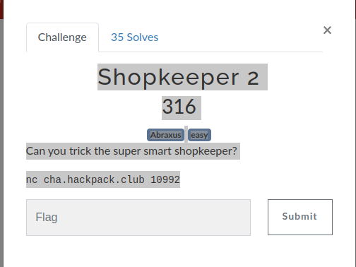

# Shopkeeper 2

## The Problem

Points: 316

Rating: easy

Author: Abraxus

Flavor Text:
```
Can you trick the super smart shopkeeper?

nc cha.hackpack.club 10992
```



## Solution

connected to the target. 
got the same output as before [a.out](a.out)

reviewed with strings a.out:

```
Do you really think this would be so easy to hack?
You didn't start all over again!
Time: %zu
How much money do you want to bet?
Don't try cheating!
What is the value? (0-9)
Correct!
Correct Value was: %d
flag-1.txt
Cannot open file 
flag-2.txt
flag{b4s364_1s_s0_c3wl_wh0_kn3w_you_c0u1d_do_th15}
;*3$"
GCC: (Debian 8.3.0-6) 8.3.0
```

found that besides the cleartext one there are two more flags in here

thinking we need to hit 3) The Key to the Flag (100 coins) to 
get the next flag?

found functions like print_flag_2


opened things up in ghidra for analysis. 


print_flag_1 just dumps the sourcefile flag-1.txt into the stout
- this is what gave us the base64 to decode
- it returns something to main that is used to resolve the flag two check

this worked out to: 
```
undefined8 print_flag_1(void)

{
  char cVar1;
  int flen;
  FILE *flag-1.txt;
  undefined8 uVar2;
  char filelength;
  
  cVar1 = Level1();
  if (cVar1 == '\0') {
    uVar2 = 0;
  }
  else {
    flag-1.txt = fopen("flag-1.txt","r");
    if (flag-1.txt == (FILE *)0x0) {
      puts("Cannot open file ");
      fflush(stdout);
                    /* WARNING: Subroutine does not return */
      exit(0);
    }
    flen = fgetc(flag-1.txt);
    filelength = (char)flen;
    while (filelength != -1) {
      putchar((int)filelength);
      flen = fgetc(flag-1.txt);
      filelength = (char)flen;
    }
    fclose(flag-1.txt);
    putchar(10);
    fflush(stdout);
    uVar2 = 1;
  }
  return uVar2;
}
```

so basicly it returns 1 or true if the function end up printing the flag 1. 
this happens when cVar1 != '\0' or false?

so setting  cVar1 to '\0' would trigger the false return

```
undefined8 main(void)

{
  char cVar1;
  undefined8 local_48;
  undefined4 local_40;
  char *flag_1;
  
  local_48 = 0x6320343665736162;
  local_40 = 0x6c6168;
  system((char *)&local_48);
  flag_1 = "flag{b4s364_1s_s0_c3wl_wh0_kn3w_you_c0u1d_do_th15}";
  cVar1 = print_flag_1();
  if (cVar1 != '\0') {
    print_flag_2();
  }
  return 0;
}
```

if level1 returns true we get to print the flag1.txt file:


the level1 function should get this to happen:
```
undefined8 Level1(void)

{
  int iVar1;
  undefined4 local_70 [2];
  char *local_68 [2];
  int local_54 [3];
  char *local_48 [4];
  uint local_28 [4];
  int local_18;
  int local_14;
  int local_10;
  char local_a;
  char local_9;
  
  fwrite("Welcome to my Shop!\nWhat would you like to do?\n",1,0x2f,stdout);
  fflush(stdout);
  local_9 = '\x01';
  local_28[0] = 0;
  local_28[1] = 0;
  local_28[2] = 0;
  do {
    while( true ) {
      while( true ) {
        if (local_9 == '\0') {
          return 0;
        }
        fwrite("1) Buy\n2) Sell\n3) View Your Inventory\n4) Leave Shop\n",1,0x34,stdout);
        fflush(stdout);
        iVar1 = getchar();
        local_a = (char)iVar1;
        getchar();
        if (local_a != '2') break;
        fwrite("What would you like to sell?\n",1,0x1d,stdout);
        fwrite("1) An Apple (1 coins)\n2) An Orange (3 coins)\n",1,0x2d,stdout);
        fflush(stdout);
        local_18 = getchar();
        local_18 = local_18 + -0x31;
        getchar();
        local_68[0] = "Apples";
        local_68[1] = "Oranges";
        local_70[0] = 1;
        local_70[1] = 3;
        if ((local_18 < 0) || (1 < local_18)) {
          fprintf(stdout,"%c is not a valid option\n",(ulong)(local_18 + 0x31));
          fflush(stdout);
        }
        else {
          fprintf(stdout,"How many %s would you like to sell?\n",local_68[local_18]);
          fflush(stdout);
          local_28[3] = getchar();
          local_28[3] = local_28[3] + -0x30;
          getchar();
          if ((int)local_28[local_18] < (int)local_28[3]) {
            fprintf(stdout,"You don\'t have enough %s :(\n",local_68[local_18]);
            fflush(stdout);
          }
          else {
            coins = coins + (char)local_70[local_18] * (char)local_28[3];
            local_28[local_18] = local_28[local_18] - local_28[3];
          }
        }
      }
      if ('2' < local_a) break;
      if (local_a == -1) {
                    /* WARNING: Subroutine does not return */
        exit(1);
      }
      if (local_a == '1') {
        fwrite("What would you like to buy?\n",1,0x1c,stdout);
        fwrite("1) An Apple (2 coins)\n2) An Orange (6 coins)\n3) The Key to the Flag (100 coins)\n"
               ,1,0x50,stdout);
        fflush(stdout);
        local_10 = getchar();
        local_10 = local_10 + -0x31;
        getchar();
        local_48[0] = "Apples";
        local_48[1] = "Oranges";
        local_48[2] = "Keys to the Flag";
        local_54[0] = 2;
        local_54[1] = 6;
        local_54[2] = 100;
        if ((local_10 < 0) || (2 < local_10)) {
          fprintf(stdout,"%c is not a valid option\n",(ulong)(local_10 + 0x31));
          fflush(stdout);
        }
        else {
          fprintf(stdout,"How many %s would you like to buy?\n",local_48[local_10]);
          fflush(stdout);
          local_14 = getchar();
          local_14 = local_14 + -0x30;
          getchar();
          if ((int)(uint)coins < local_54[local_10] * local_14) {
            fwrite("You don\'t have enough money :(\n",1,0x1f,stdout);
            fflush(stdout);
          }
          else {
            coins = coins - (char)local_54[local_10] * (char)local_14;
            local_28[local_10] = local_28[local_10] + local_14;
          }
        }
      }
      else {
LAB_0040170f:
        fwrite("Do you really think this would be so easy to hack?\n",1,0x33,stdout);
        fflush(stdout);
      }
    }
    if (local_a == '3') {
      fprintf(stdout,"You have %d gold coins!\n",(ulong)coins);
      fprintf(stdout,"You have %d Apples!\n",(ulong)local_28[0]);
      fprintf(stdout,"You have %d Oranges!\n",(ulong)local_28[1]);
      fprintf(stdout,"You have %d Keys to the Flag!\n",(ulong)local_28[2]);
      fflush(stdout);
      if (0 < (int)local_28[2]) {
        fwrite("Congrats!! You have the key!\n",1,0x1d,stdout);
        fflush(stdout);
        return 1;
      }
    }
    else {
      if (local_a != '4') goto LAB_0040170f;
      fwrite("Goodbye then!\n",1,0xe,stdout);
      fflush(stdout);
      local_9 = '\0';
    }
  } while( true );
}
```

we messed with the direct input and found that the cli would allow for selling/buying negative value inputs.

doing this a few times allows us to build up the 100 coins needed to buy the key and checking the inventory validates and provides the flag.

this is the resulting input for the solve:

```
nc cha.hackpack.club 10992
1
2
-1
-1
2
-1
-1
2
-1
-1
2
-1
-1
2
-1
-1
3
1
3
```


## Flag


flag returns if you can get the coins up to 100 and buy a key

```
flag{g00d_job_y0u_b3at_7he_sh0pk3eper}
```

## Final Thoughts

Nice simple reversing problem with a solution that didnt require anything crazy. players could definately work this one out without additional tools or reviewing the sourcecode.

This was part 2 of 3. [Shopkeeper3](../Shopkeeper3)

