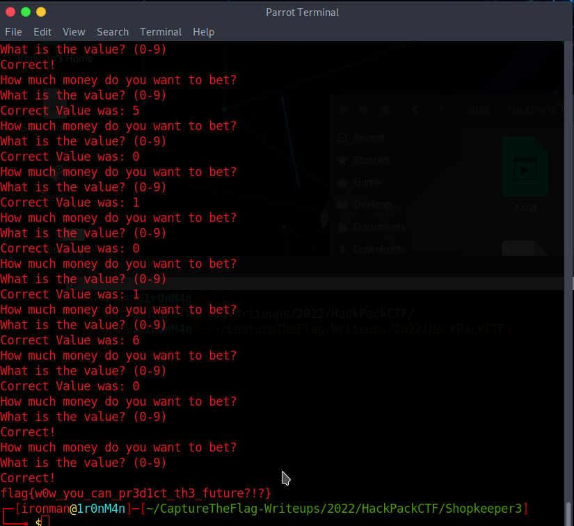

# Shopkeeper 3

## The Problem

Points: 384

Rating: easy

Author: Abraxus

Flavor Text:

```
Wow! You've beaten the shopkeeper, but how about the gambler?

nc cha.hackpack.club 10992 # or 20992
```

## Solution

so this one depends on a function Level2 returning true or rather not false

if it doesn't then flag-2.txt is not printed 

the glorious level2:
```
undefined8 Level2(void)

{
  char cVar1;
  int iVar2;
  int iVar3;
  undefined8 uVar4;
  time_t tVar5;
  
  if (coins == 0x13) {
    tVar5 = time((time_t *)0x0);
    fprintf(stdout,"Time: %zu\n",tVar5);
    srand((uint)tVar5);
    while (coins != 0x37) {
      fwrite("How much money do you want to bet?\n",1,0x23,stdout);
      fflush(stdout);
      iVar2 = getchar();
      if ((char)iVar2 < '\0') {
        fwrite("Don\'t try cheating!\n",1,0x14,stdout);
        fflush(stdout);
        return 0;
      }
      cVar1 = (char)iVar2 + -0x30;
      if (((int)(uint)coins < (int)cVar1) || (cVar1 < '\0')) {
        fwrite("Don\'t try cheating!\n",1,0x14,stdout);
        fflush(stdout);
        return 0;
      }
      fwrite("What is the value? (0-9)\n",1,0x19,stdout);
      fflush(stdout);
      iVar2 = getchar();
      iVar3 = rand();
      if (iVar3 % 10 == (int)(char)((char)iVar2 + -0x30)) {
        fwrite("Correct!\n",1,9,stdout);
        fflush(stdout);
        coins = cVar1 + coins;
      }
      else {
        fprintf(stdout,"Correct Value was: %d\n",(ulong)(uint)(iVar3 % 10));
        fflush(stdout);
      }
    }
    uVar4 = 1;
  }
  else {
    fwrite("You didn\'t start all over again!\n",1,0x21,stdout);
    fflush(stdout);
    uVar4 = 0;
  }
  return uVar4;
}

```

if your coins are not equal to 19 then you get a false response and an error. So our initial solve needs some work

so we get to level 2 if you buy and sell to get to 119 coins before viewing the inventory or buying the keys


After playing with it we found that you could buy(2 coins) and sell(1 coins) oranges to get to an odd number of coins once we had more than the 119(100 to get the level1 key and 19 to start the level2 check)


looks like we need 55 coins to win

```
while (coins != 0x37) {
```

this checks for things like -1 so no breaking it here
```
if ((char)usr_input_bet < '\0') {
```

reviewing the source it looks like you don't lose coins for guessing wrong so we picked bets on 9 to maximize the wins

used some shelscript to automate the passing [level 1](../Shopkeeper2/solve.sh) allowing us to focus on level 2

played with various combos in level two to correctly get to 4 wins with number 9. that brings the total coin bank up to the 55 needed

this came out to: 

[solve.sh](solve.sh)

```
#!/bin/bash

nc cha.hackpack.club 10992 <<END
1
2
-1
-1
2
-1
-1
2
-1
-1
2
-1
-1
2
-1
-1
2
-1
-1
2
-1
-1
0
1
1
9
2
1
1
3


1
3
1
3
999999999999999999999999999999999999999999999999999999999999


END
```

run this and it cracks the level 2, the 99999 force the bet to repeat and the code doesn't lose us coins for guessing wrong.



## Flag
```
flag{w0w_you_can_pr3d1ct_th3_future?!?}
```


