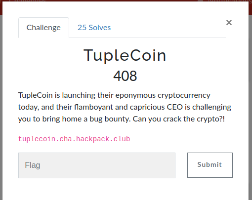
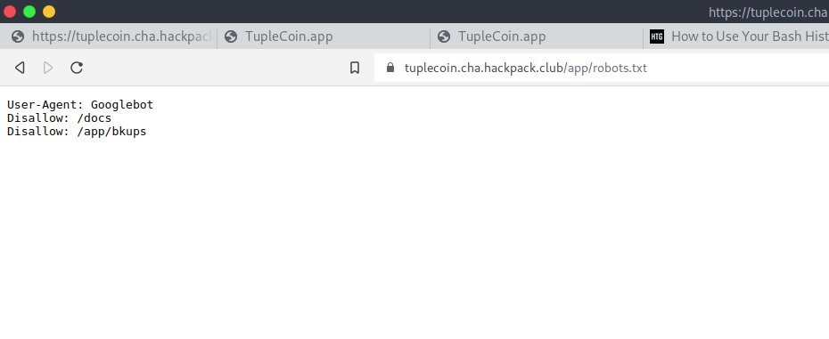
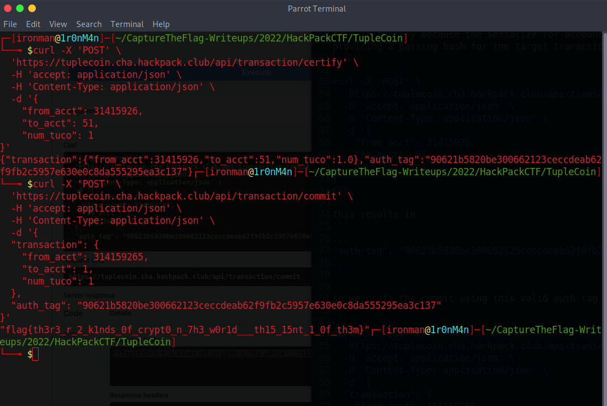

# TupleCoin

## The Problem

Points: 408

Flavor Text:

```
TupleCoin is launching their eponymous cryptocurrency today, and their flamboyant and capricious CEO is challenging you to bring home a bug bounty. Can you crack the crypto?!

tuplecoin.cha.hackpack.club
```



## Solution

we explore tuplecoin.cha.hackpack.club

look at the robots



docs pulls up an API browser. very handy


the bkups provides the source code for the site. [main.py](main.py)

the vars:
```
SECRET_KEY = secrets.token_bytes(32)    # random each time we run
TUCO_ACCT_NUM = 314159265
```

we already know the tuco thing from the main page


```
/api/transaction/commit
```
returns the flag if we call it using the tuco account number. so the goal is as stated. Make a transfer from the tuco account and you are done


```
def sign(self, secret_key: bytes) -> AuthenticatedTransaction:
        tuco_smash = self.serialize()
        tuco_hash = hmac.new(secret_key, tuco_smash, "sha256").hexdigest()
        
        return CertifiedTransaction.parse_obj({
            "transaction": {
                "from_acct": self.from_acct,
                "to_acct": self.to_acct,
                "num_tuco": self.num_tuco
            },
            "auth_tag": tuco_hash,
        })
        
```

we need to get the secret by reverse engineering the signing function. 

the signing function is made up with the secret(fixed token size generated each time the server is started) and: 
the serialized object(fixed thing we can know and provide)

```
    def serialize(self) -> bytes:
        return (str(self.from_acct) + str(self.to_acct) + str(self.num_tuco)).encode()
```

this is the key because the serialize for account   1234 and 567 is the same as 123 and 4567 we can fudge the certify into providing a passing hash for the target transaction

```
curl -X 'POST' \
  'https://tuplecoin.cha.hackpack.club/api/transaction/certify' \
  -H 'accept: application/json' \
  -H 'Content-Type: application/json' \
  -d '{
    "from_acct": 31415926,
    "to_acct": 51,
    "num_tuco": 1
}'
```

this results in
```
...
"auth_tag": "90621b5820be300662123ceccdeab62f9fb2c5957e630e0c8da555295ea3c137"
...
```

so we craft the commit using this valid auth tag

```
curl -X 'POST' \
  'https://tuplecoin.cha.hackpack.club/api/transaction/commit' \
  -H 'accept: application/json' \
  -H 'Content-Type: application/json' \
  -d '{
  "transaction": {
    "from_acct": 314159265,
    "to_acct": 1,
    "num_tuco": 1
  },
  "auth_tag": "90621b5820be300662123ceccdeab62f9fb2c5957e630e0c8da555295ea3c137"
}'

```




## Flag

the response is: 
```
"flag{th3r3_r_2_k1nds_0f_crypt0_n_7h3_w0r1d___th15_15nt_1_0f_th3m}"
```

