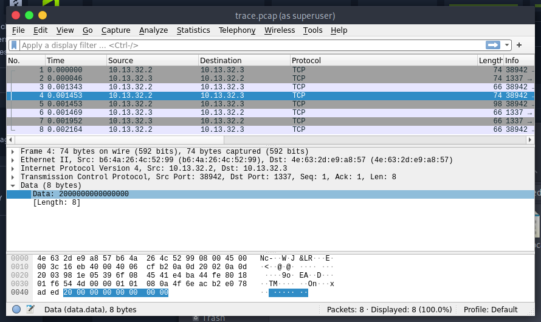
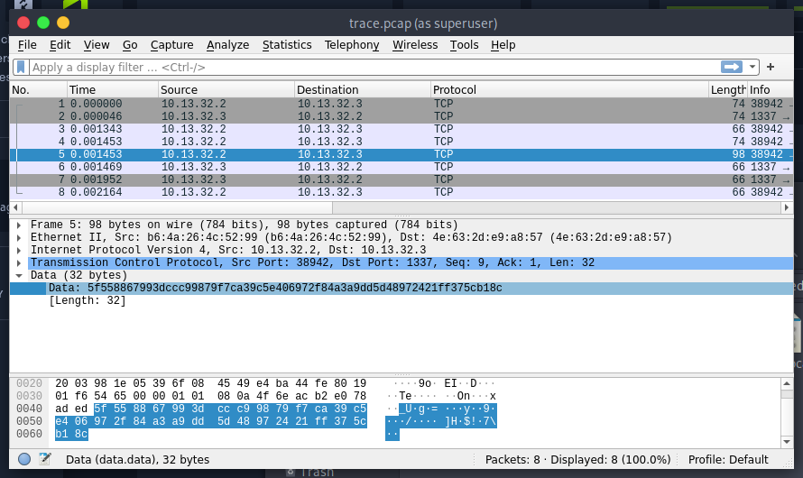
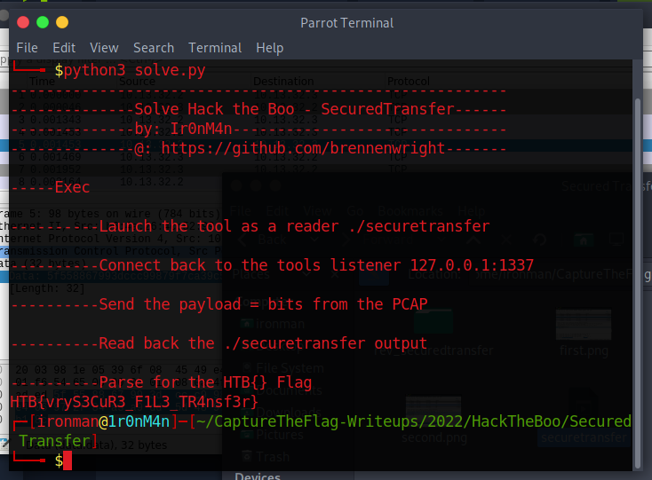

# Secured Transfer

## The Problem

Rating: medium

Flavor Text:
```
Ghosts have been sending messages to each other through the aether, but we can't understand a word of it! Can you understand their riddles?
```

Attachments : [rev_securedtransfer.zip](./rev_securedtransfer.zip)


## Solution


the pcap includes options with odd values and the provided filetool seems to send and receive filedata

trace.pcap:
```
the first data sent:
200000000


and the second:
5f558867993dccc99879f7ca39c5e406972f84a3a9dd5d48972421ff375cb18c
```





I first tried to patch the binary to make it assume it recieved that original data but the padding didnt work out. 

i ended up launching the receiver and sending it the encoded signals.


[solve.py](./solve.py)


## Flag
```
HTB{vryS3CuR3_F1L3_TR4nsf3r}
```

## Final Notes
