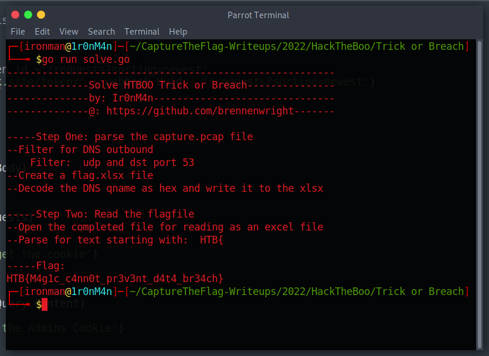

# Trick or Breach

## The Problem

Rating: Easy

Author:

Flavor Text:
```

Our company has been working on a secret project for almost a year. None knows about the subject, although rumor is that it is about an old Halloween legend where an old witch in the woods invented a potion to bring pumpkins to life, but in a more up-to-date approach. Unfortunately, we learned that malicious actors accessed our network in a massive cyber attack. Our security team found that the hack had occurred when a group of children came into the office's security external room for trick or treat. One of the children was found to be a paid actor and managed to insert a USB into one of the security personnel's computers, which allowed the hackers to gain access to the company's systems. We only have a network capture during the time of the incident. Can you find out if they stole the secret project?


```

Attachments : [forensics_trick_or_breach.zip](./forensics_trick_or_breach.zip)


## Solution

Its a list of dns queries all to the host with a subdomain of curious chars

the bits look like hex and sure enough the first few 50 4B 03 04 14 00 08 00 are a magic header for a jar file. but the longer version shows Excel sheet


I ran up a solve script to parse the data, make a readable file and then parse the file as excel to find the flag

[solve.go](./solve.go)



## Flag
```
HTB{M4g1c_c4nn0t_pr3v3nt_d4t4_br34ch}
```

## Final Notes
