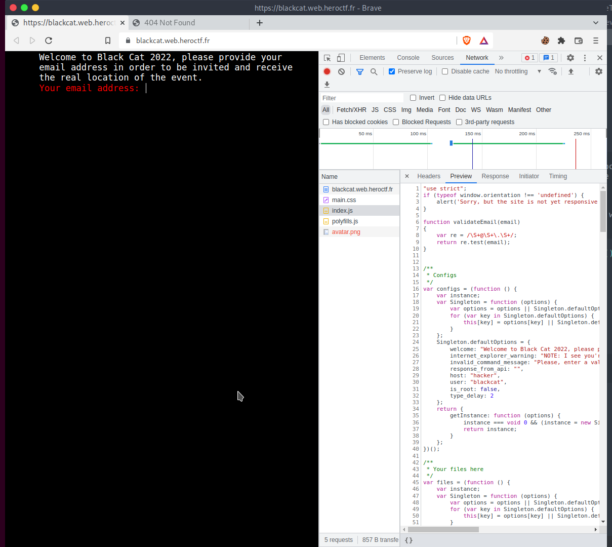

# BlackCat

## The Problem

Points: 

Rating: easy

Author: Worty

Flavor Text:
```
You have heard about a new event that will take place in a secret location. At this event, there doesn't seem to be any legal conferences, and it seems to gather black hat. Find a way to get the location of this conference before the deadline.

https://blackcat.web.heroctf.fr/

```

Attachments : []()


## Solution


took a look at the site and found a simple cli input 



downloaded the js the page loaded for review. it looks to run the whole interface
[index.js](index.js)


found the handler for the email input
```
            var xhr = new XMLHttpRequest();
            xhr.open("POST","/api/newsletter.php",true)
            xhr.send('email='+cmdComponents[0])
            this.apiResponse(cmdComponents,"You will receive the email for the exact location in 3 days. Thank you.")
     
```

```
curl 'https://blackcat.web.heroctf.fr/api/newsletter.php' \
  --data-raw 'email=test@happy.com' \      
  --compressed
{"ok":"You will receive the email for the exact location in 3 days. Thank you."}
```

the response object looks like {status ,  message} and email is the only input

trying to fuzz it

payload: email=test 
this seems to bypass the clis email validity check and returns
{"ok":"You will receive the email for the exact location in 3 days. Thank you."}

payload:  "email='"
{"error":"An error occured, please try again."}

looks like something to dig into. 


after further review of the js this looked interesting
```
for (var file in files.getInstance()) {
            var element = document.createElement("button");
            Terminal.makeElementDisappear(element);
            element.onclick = function (file, event) {
                this.handleSidenav(event);
                this.cmdLine.value = "cat " + file + " ";
                this.handleCmd();
            }.bind(this, file);
            element.appendChild(document.createTextNode(capFirst(file.replace(/\.[^/.]+$/, "").replace(/_/g, " "))));
            this.sidenav.appendChild(element);
            this.sidenavElements.push(element);

```

the page has a hidden element "sidenav" that can be altered to display


this explains the avatar image that is failing. 


insert into emails? email = ''';


## Flag
```

```

## Final Notes
