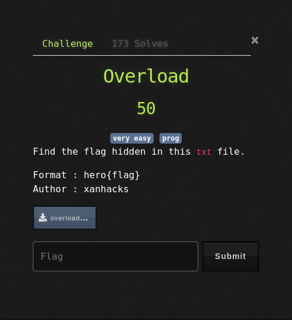
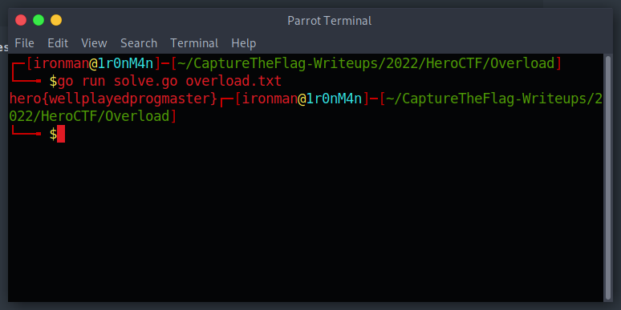

# Overload

## The Problem

Points: 50

Rating: very easy prog

Author: xanhacks

Flavor Text:
```

Find the flag hidden in this txt file.


```

Attachments : [overload.txt](overload.txt)



## Solution

reviewing the file finds chars that dont work for base64 --decode 

It looks like it has a '}' and maybe a '{' in it that would signal it isnt encoded. 

eyeballing it further and we see a few lowercase characters that starts with h as in hero from our flag. 

I manually removed a few characters and thats exactly whats going on. wiped up a quick solve script in go to strip out the chars: [solve.go](solve.go) 


```
package main

import (
    "fmt"
    "io/ioutil"
    "log"
    "os"
)

func main() {

    if len(os.Args) < 2 {
        fmt.Println("usage: solve.go overload.txt")
        return
    }

    file, err := os.Open(os.Args[1])
    if err != nil {
        log.Fatal(err)
    }

    text, err := ioutil.ReadAll(file)
    if err != nil {
        log.Fatal(err)
    }

    for _, char := range text {
        if char > 96 {
            fmt.Printf("%c", char)
        }

    }

}


```

run this badboy and:



## Flag
```
hero{wellplayedprogmaster}
```

## Final Notes
