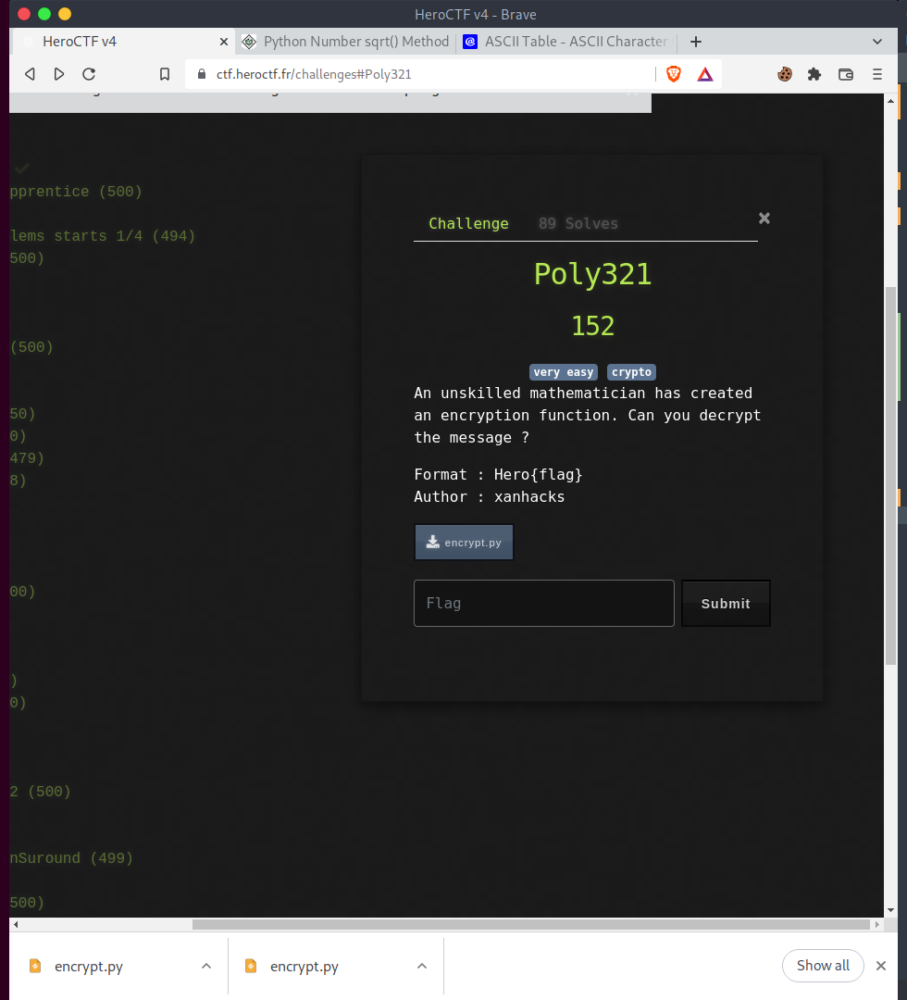

# Poly321


## The Problem

Points: 152

Rating: very easy crypto

Author:

Flavor Text:
```
An unskilled mathematician has created an encryption function. Can you decrypt the message ?

Format : Hero{flag}
Author : xanhacks


```

Attachments : [encrypt.py](encrypt.py)



## Solution

the provided program included a comment section at the bottom with the encoded key:

```
[378504, 1040603, 1494654, 1380063, 1876119, 1574468, 1135784, 1168755, 1534215, 866495, 1168755, 1534215, 866495, 1657074, 1040603, 1494654, 1786323, 866495, 1699439, 1040603, 922179, 1236599, 866495, 1040603, 1343210, 980199, 1494654, 1786323, 1417584, 1574468, 1168755, 1380063, 1343210, 866495, 188499, 127550, 178808, 135303, 151739, 127550, 112944, 178808, 1968875]
```

I reworked the [encrypt.py](encrypt.py) program to print each character likely to be included in the flag and used the resulting codes to work out the flag.


## Flag
```

Hero{this_is_very_weak_encryption_92835208}

```

## Final Notes
