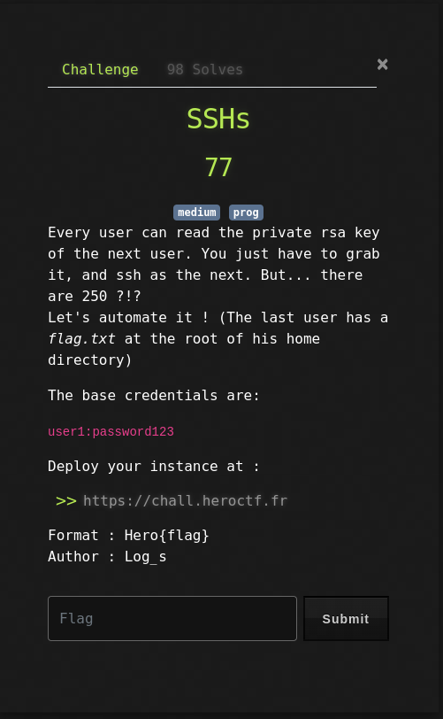
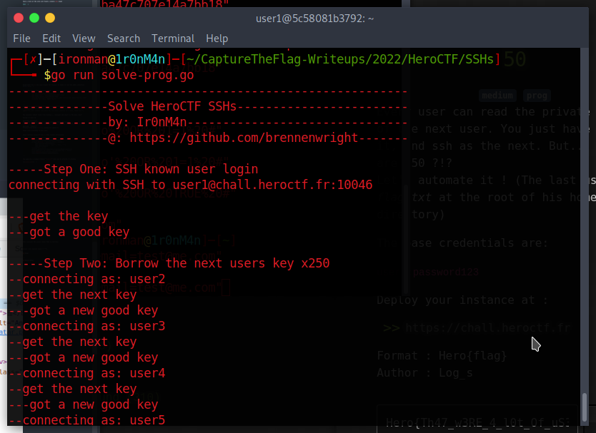
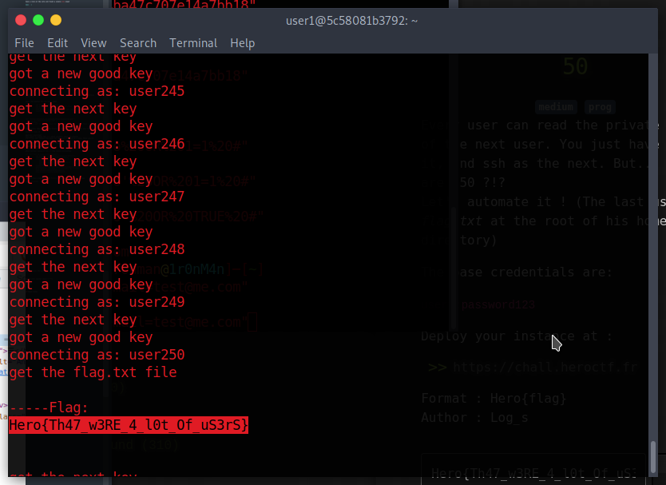

# SSHs

## The Problem

Points: 50

Rating:medium prog

Author: Log_s

Flavor Text:
```
Every user can read the private rsa key of the next user. You just have to grab it, and ssh as the next. But... there are 250 ?!?
Let's automate it ! (The last user has a flag.txt at the root of his home directory)

The base credentials are:

user1:password123

Deploy your instance at :

https://chall.heroctf.fr


```

Attachments : [https://chall.heroctf.fr](https://chall.heroctf.fr)



## Solution

whip up a solve script to ssh and loop through the provided keys

first we need to ssh for the first one, parse the output and open the next to repeat until no more rsas show up.

looks like the last step is to cat the flag.txt and print 

I worked up the [solve](solve.go) script in golang



and at the end of the run:



looking good.

## Flag
```
Hero{Th47_w3RE_4_l0t_Of_uS3rS}
```

## Final Notes

running the script to ssh inside the remote session might be much faster than this as the waiting for the remote connection is looooong.