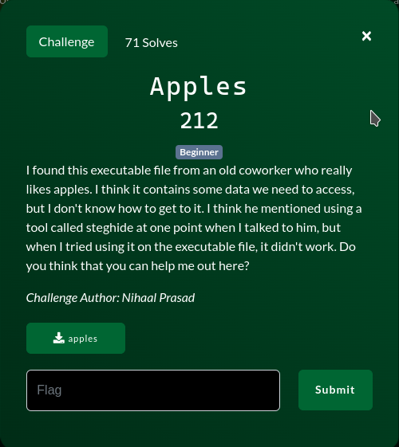
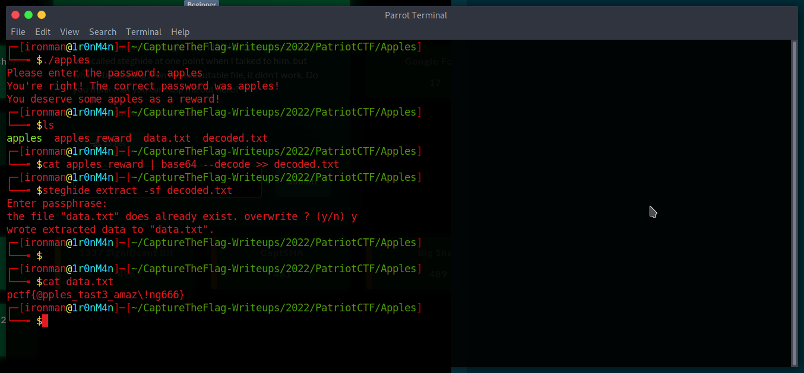

# Apples

## The Problem

Points: 212

Rating: Beginner

Author: Nihaal Prasad

Flavor Text:
```
I found this exec file from and old coworker who really likes apples...

```

Attachments : [apples](apples)



## Solution

the initial program includes a large base64 file that dumps out to [apples_reward](apples_reward)

it can be base64 decoded to the image it is: [decode.jpg](decode.jpg)

stego is the next likely step. 

steghide extract -sf decoded.txt nets us the flag




## Flag
```
pctf{@pples_tast3_amaz\!ng666}
```

## Final Notes
