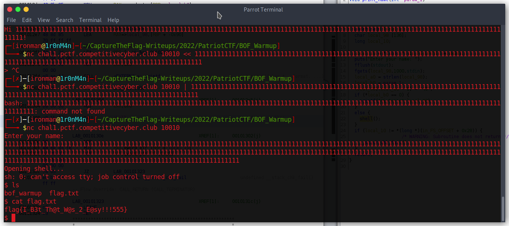

# BOF Warmup

## The Problem

Points: 

Rating:

Author:

Flavor Text:
```

nc chal1.pctf.competitivecyber.club 10010


```

Attachments : [bof_warmup](bof_warmup)

## Solution



the service response and is a simple buffer overflow. 

tryed a few things and enough characters in the input dropped to the shell to print the flag.

## Flag
```
flag{I_B3t_Th@t_W@s_2_E@sy!!!555}
```

## Final Notes
