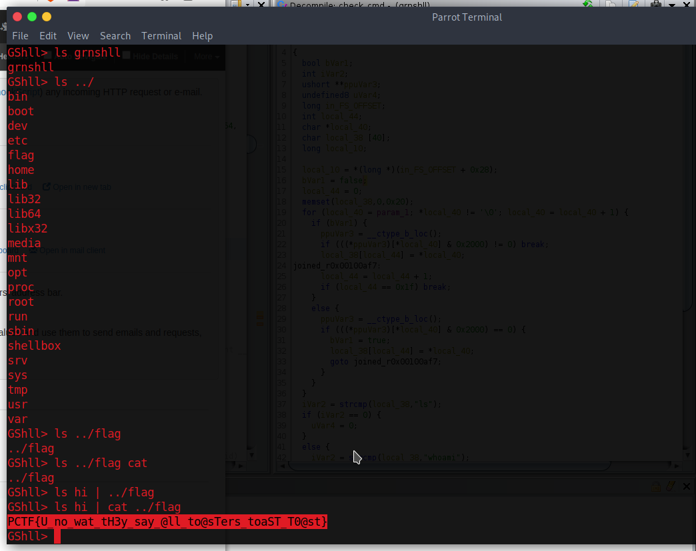

# Green Shell

## The Problem


Flavor Text:
```


```

Attachments : [grnshll](grnshll)


## Solution


the shell is limited in its execution and just prints the simple commands. 

however if you pipe '|' in a second command that one actually executes.  



## Flag
```
PCTF{U_no_wat_tH3y_say_@ll_to@@sTers_toaST_T0@st}
```

## Final Notes
