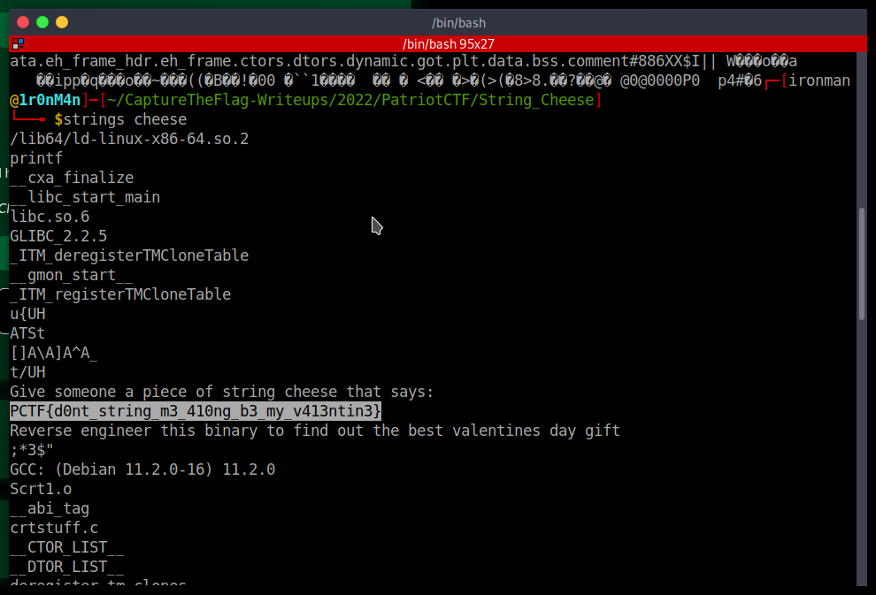

# String Cheese

## The Problem

Points: 355

Rating: Beginner

Author: Daniel Getter

Flavor Text:
```
I haven't had string cheese since elementary school :()


```

Attachments : [cheese](cheese)


## Solution

downloading the file you start with files, cat and strings

strings cheese pulls the following:




## Flag
```
PCTF{d0nt_string_m3_410ng_b3_my_v413ntin3}

```

## Final Notes

beginner for sure