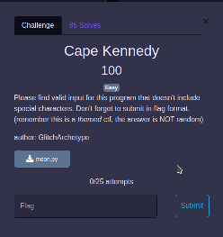
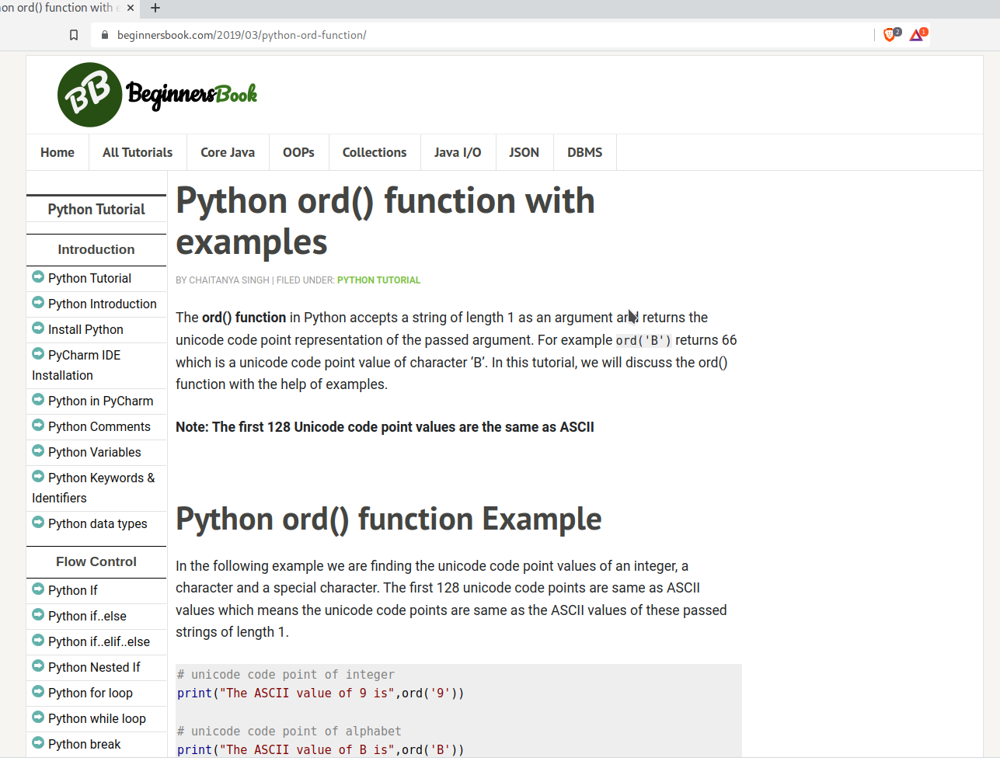

# Cape Kennedy

## The Problem

Points: 100

Rating: Easy

Flavor Text:
```
Please find valid input for this program that doesn't include special characters. Don't forget to submit in flag format. (remember this is a themed ctf, the answer is NOT random)
```

Author: GlitchArchetype

Attachments : [moon.py](moon.py)




## Solution

Downloaded moon.py and reviewed the code
```
import sys

def main():
  if len(sys.argv) != 2:
    print("Invalid args")
    return

  password = sys.argv[1]
  builder = 0
  
  for c in password:
    builder += ord(c)
  
  if builder == 713 and len(password) == 8 and (ord(password[2]) == ord(password[5])):
    if (ord(password[3]) == ord(password[4])) and ((ord(password[6])) == ord(password[7])):
        print("correct")
    else:
        print("incorrect")
  else:
    print("incorrect")

if __name__ == "__main__":
  main()
  ```


  its not a big program so shouldn't be tough to back into the input, its an option to brute force it but lets just work out the logic 


 this one tells me the input is a single value input:
 ```
if len(sys.argv) != 2:   
```

  the flavor text says no special chars so the flag format is not the input but the xxxxx's:
  ```
  shctf{xxxxxxxx}?
  ```

googled: python ord value and picked a tutorial site to work out the basic function per this site: 

 >"The ord() function in Python accepts a string of length 1 as an argument and returns the unicode code point representation of the passed argument. For example ord('B') returns 66 which is a unicode code point value of character ‘B’." - https://beginnersbook.com/2019/03/python-ord-function/

 it looks like we have an ASCII flip going on so pull up: https://www.ascii-code.com/


 ```
   password = sys.argv[1]
 ``` 
 this tells me the input is tested like: 
 ```
 py moon.py XX
 ```

 this tells me the input is likely 8 chars like xxxxxxxx so shctf{xxxxxxxx}?
 ```
 len(password) == 8
 ```

need to lookup the ord function as I do not use python often



looks like the ord call and the third(3-1 because we count from 0 in CS) and sixth character are the same value
 ```
 ord(password[2]) == ord(password[5])
 ```
 
and 4th and 5th are the same, and 7th and 8th are the same
```
 ord(password[3]) == ord(password[4])) and ((ord(password[6])) == ord(password[7])
```

 what hints do we have? 
 >"CapeKennedy"
 
 is the title so lets google it
> "On November 28, 1963 President Lyndon B. Johnson announced in a televised address that Cape Canaveral would be renamed Cape Kennedy" - https://sonalsart.com/why-did-cape-kennedy-changed-name/

found a space center and well know launch site


so the logic is:

* the string is eight chars long likely meeting the theme
* the string does not include special characters(65-90 + 97-122 in ASCII) and no shctf{} included
* the sum of the ascii values of these chars is 713 (so the average char value is 89.125, this means we are going to be light on the capitals)
* the 3rd and 6th character are the same
* the 4th and 5th character are the same
* the 7th and 8th character are the same

as we are looking for an eight character input Canaveral, kennedy, florida and such don't work

made a new version called [moon_trace.py](moon_trace.py) so I can run with the variables printing out to console
> python [moon_trace.py](moon_trace.py) xxxxxxxx
 

I started messing with word-list generators and the randomness didn't work that well until I built a list of all possible correct values to search against. (this is a big ridiculous list and all values work so no bruit force option anyhow)

I then googled all of the keywords gathered moon Cape Kennedy Canaveral


I ended up looking into moon tree as the "ree" matched the last three logic terms and in the course of digging into one site found Apollo. 


This reminded me of the moon landing and led to searching the word-list for Apollo and finding a few of the correct ones that ended in numbers. Apollo11 being historic and the likely choice.


tripple check this against the source and it reports correct()
```
python moon_trace.py 
```

## Flag

And done!!
```
 shctf{Apollo11}
```


## Final Notes
I know i didnt need to go into so much detail as i reviewed the mmon.py script but i was in a detailed note mode.