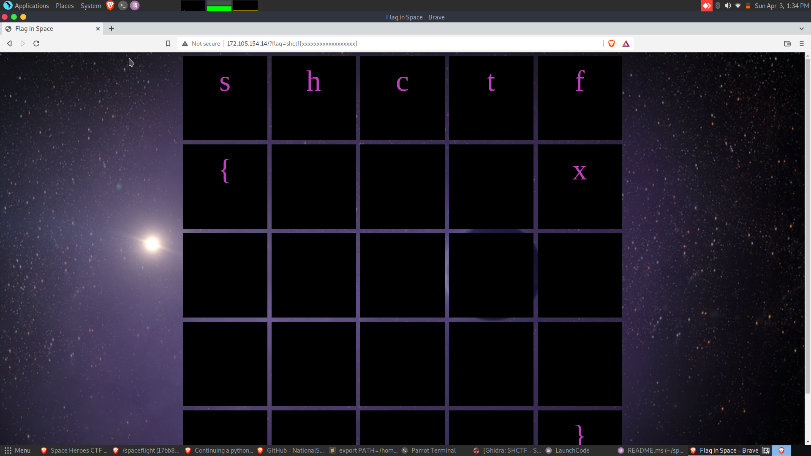

# Flag in Space

## The Problem

Points: 100

Rating: Easy

Flavor Text:
```
“The exploration of space will go ahead, whether we join in it or not.” - John F. Kennedy
```

Attachments :  http://172.105.154.14/?flag=


## Solution


hit the webpage to find a grid of empty squares. 


thinking flags? tried USA and such nothing changes

reviewed the source to find its a static page only so everything is server-side based on the url string


this isnt in the pwn section so we likely don't need to try and manipulate the url string.

it is asking for a flag so the format is something like shctf{xxx}?
tryed http://172.105.154.14/?flag=shctf{} and got:


so the close bracket isnt showing. this is a codebreak game where you have to fill int he correct character to have it display. could write a script to try chars until they print? 

first counting the squares should let us place the close bracket reducing the chars we need to track down

try this:
http://172.105.154.14/?flag=shctf{xxxxxxxxxxxxxxxxxx}

got one of the xs by accident as well :)


first lets apply logic here, lets try vowels as a message would have several of them. I also google the quote and search the remainder of the speech for x and realism e comes before x a lot.

aaaaaaaaaaaaaa
eeeeeeeeeeeeee

iiiiiiiiiiiiii
found an i

yyyyyyyyyyyyyyyyyy
oooooooooooooo

uuuuuuuuuuuuuuuuuu
444444444444444444
__________________

so far we are at
```
shctf{xxexxxoxxxxxoxxixx}
```

we know spaces are _ for this event try those
```
shctf{x_exxxoxx_xxoxxixx}
```


dont forget 1337 speak letters like 4 3 and such

tryed the first word as it is a single char so a I U 4

using leet and the middle word worked out explore
```
shctf{2_explor3_xxoxxi3r}
```
got the ier at the end and searched the source text to find frontier?


## Flag
and there we are:

```
shctf{2_explor3_fronti3r}
```

## Final Notes

not sure this one needed to be in a CTF but allrighty then