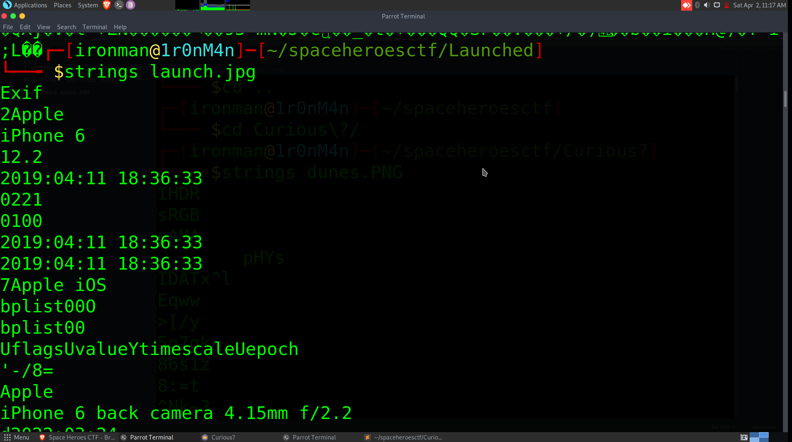

# Launched

## The Problem
Points: 100

Rating:Easy

Author: GlitchArchetype

Flavor Text:
```

What is the name of the launch and the payload in this picture. (flag format is shctf{rocket_payload}, spaces are underscores)


```

Attachments : [launch.jpg](launch.jpg)


## Solution


downloaded the image and ran strings launch.jpg on it to look for sneaky things



dumped a bunch of normal image chars but the headers included date info: 
```
12.2
2019:04:11 18:36:33
0221
0100
2019:04:11 18:36:33
2019:04:11 18:36:33
```

Looking for a rocket launch on that date and time


https://en.wikipedia.org/wiki/2019_in_spaceflight#April

Space X(looks like the student admins have a thing for Spacex :)


## Flag
format the string per the intro
```
shctf{Falcon_Heavy_Arabsat-6A}
```

## Final Notes
fun to do some OSint in these events. really enjoyed the cross reference