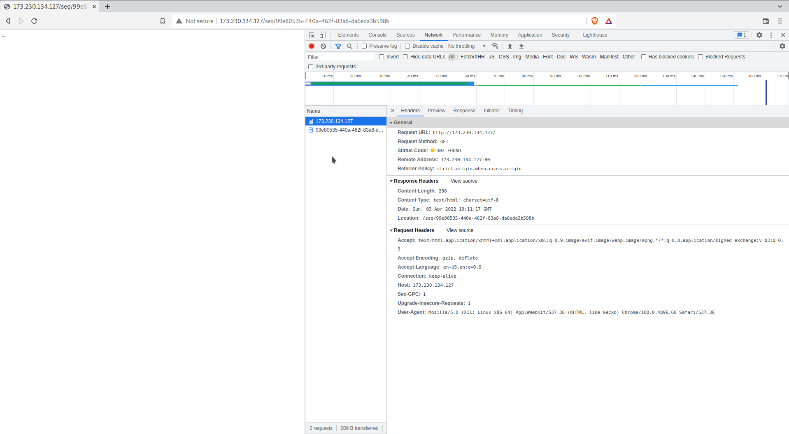
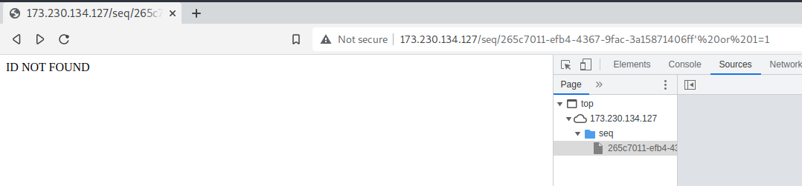
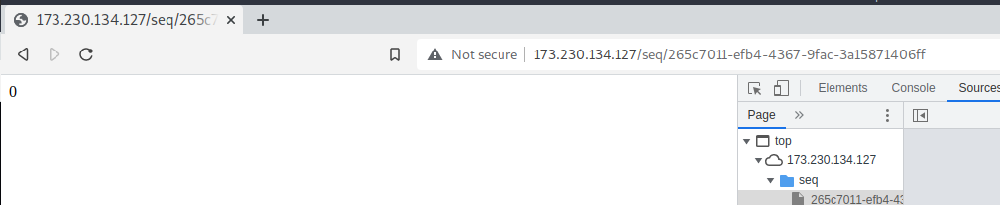
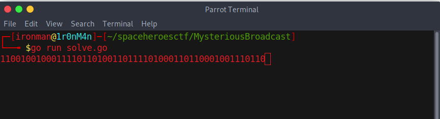
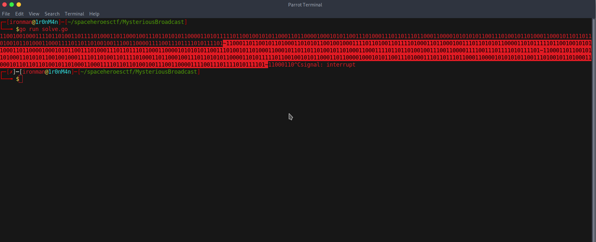

# Mysterious Broadcast

## The Problem

Points: 100

Rating: Hard

Flavor Text: 
```
There used to be 8 Models of humanoid cylon but now there are only 7. We've located one of their broadcast nodes but we can't decode it. Are you able to decipher their technologies?
```

http://173.230.134.127

Author: blakato


## Solution

ahh a Battlestar reference

Hit the http://173.230.134.127 site to see whats up

the site redirects to http://173.230.134.127/seq/c38c5e97-f9d3-47f6-9f99-b369e1e6b482
and each attempt gets a new seq



this likely causes enumeration of directories an issue as they are likely generated at each request


just /seq/ fails


the pages are responding with only ~


changing the /seq/? to anything else gets ID NOT FOUND


so likely we need to find the next one in the sequence?
```
265c7011-efb4-4367-9fac-3a15871406ff

403672a4-e287-457e-9ae4-604d4c97831e

06ff8602-2f67-4ea3-8deb-e231b2cae8fe

023618a2-2344-49aa-ac45-cacac3b32e8f

1e8c53bd-4ab2-46dc-bbd7-5eab03328c2d

02741b68-7d50-49b9-ad2b-a5209d3b5826

6727d15b-a2f5-4caa-8bee-7ca6045b3b63

0872ed61-66a6-4e45-8a12-fae6c98621f1

5f432fc2-9472-4a01-a1a8-f2fd06485c63

a175d2b9-3d2b-46ff-a42e-33f4b6b785df
```
maybe a database? if there is an ID then lets try some SQLi



%20or%201=1 resulting in the record being 1

'%20or%201=1 results in the record being 0


If i hit the root we get a new id and value of ~ that I can then change. 

this looks to be creating a new database object with each request? and setting it in a way that can be changed later?

but if I manage to alter something using a different ID the clean ids responses also change to 1s and 0s?

no wait!!! refreshing it after doing that causes a 1 or 0 result? maybe in a pattern?



I typed out a quick golang [script](solve.go) to dump the body response to command-line and see if I can recognize anything with the output:
```
package main

import (
   "io/ioutil"
   "fmt"
   "net/http"
)


func main() {

    for {
       resp, _ := http.Get("http://173.230.134.127/seq/0872ed61-66a6-4e45-8a12-fae6c98621f1")

        //We Read the response body on the line below.
       body, _ := ioutil.ReadAll(resp.Body)

        //Convert the body to type string
       sb := string(body)
       fmt.Printf(sb)
       }
}

```


this showed good things


the pattern seems to repeat starting with ~
you can really see this in effect when they are lined up

``` ~1100011011001011010001101010110010010001111011010011011110100011011000100111011010101100001101011111011001001010110001101100001000101011001110100011101101110110001100001010101011001110100101101000110001011011011010010110100011000111101101101001001110011000011110011101111010111101
~1100011011001011010001101010110010010001111011010011011110100011011000100111011010101100001101011111011001001010110001101100001000101011001110100011101101110110001100001010101011001110100101101000110001011011011010010110100011000111101101101001001110011000011110011101111010111101
```

I googled up a binary to ascii conversion page to easily see if it converts to anything tricky

this breaks down to garbage unprintable mess in all the usual cyphers/formats:
```
11000110 11001011 01000110 10101100 10010001 11101101 00110111 10100011 01100010 01110110 10101100 00110101 11110110 01001010 11000110 11000010 00101011 00111010 00111011 01110110 00110000 10101010 11001110 10010110 10001100 01011011 01101001 01101000 11000111 10110110 10010011 10011000 01111001 11011110 10111101
```

flipped this didn't return anything of note 
```
10111101 01111011 10011110 00011001 11001001 01101101 11100011 00010110 10010110 11011010 00110001 01101001 01110011 01010101 00001100 01101110 11011100 01011100 11010100 01000011 01100011 01010010 01101111 10101100 00110101 01101110 01000110 11000101 11101100 10110111 10001001 00110101 01100010 11010011 01100011
```

nothing. herm the flavor text says "8 models and now only 7 ..."? maybe these are not 8 bit chars then?

if you split the binary into 7 bit you get:
```
1100011 0110010 1101000 1101010 1100100 1000111 1011010 0110111 1010001 1011000 1001110 1101010 1100001 1010111 1101100 1001010 1100011 0110000 1000101 0110011 1010001 1101101 1101100 0110000 1010101 0110011 1010010 1101000 1100010 1101101 1010010 1101000 1100011 1101101 1010010 0111001 1000011 1100111 0111101 0111101
```

resulting in 
```
c2hjdGZ7QXNjaWlJc0E3Qml0U3RhbmRhcmR9Cg==
```

I found a bash command that converts the binary over to ascii and modified it to 7 bits and confirmed the base64?

this is a base64 string thanks to the '==' 
lets convert that:

```
echo 'c2hjdGZ7QXNjaWlJc0E3Qml0U3RhbmRhcmR9Cg==' | base64 --decode
```


## Flag
and thus the flag
```
shctf{AsciiIsA7BitStandard}
```

## Final Notes
Loved the joke in the flag. It is nice to not need more advanced tools.


