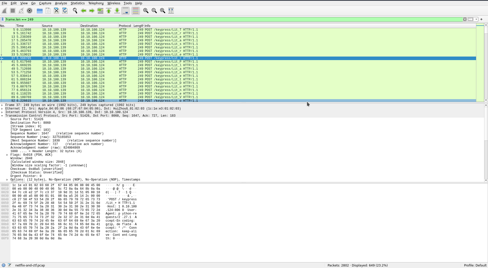

# Netflix and CTF

## The Problem

Points: 100

Rating: Easy

Author: v10l3nt

Flavor Text:
```
I don't like watching anything other than TV shows about Space Heroes.

```

Attachments : [netflix-and-ctf.pcap](netflix-and-ctf.pcap)


## Solution

downloaded the attached [pcap](netflix-and-ctf.pcap) and opened it up in wireshark

usr agent shows as python 2.27 requesting 10.10.100.124:8060/search/browse
response looks good and says the devise is a roku
http://10.10.100.124:8060/keypress/Lit_e


wireshark needed some filtering to make things easier to read




the Lit_X repeats and can be traced for the shows they are asking for. the text 

```
Treasure+Planet
Dune
Voltron+in+Space
Treasure+Planet
Dune
Highlander
Highlander
Voltron+in+Space
Dune
Star+Trek
shctf{T1m3_is_th3_ultimat3_curr3Ncy}
Star+Wars
shctf{T1m3_is_th3_ultimat3_curr3Ncy}...
```


## Flag
includes the flag

```
shctf{T1m3_is_th3_ultimat3_curr3Ncy}
```

## Final Notes