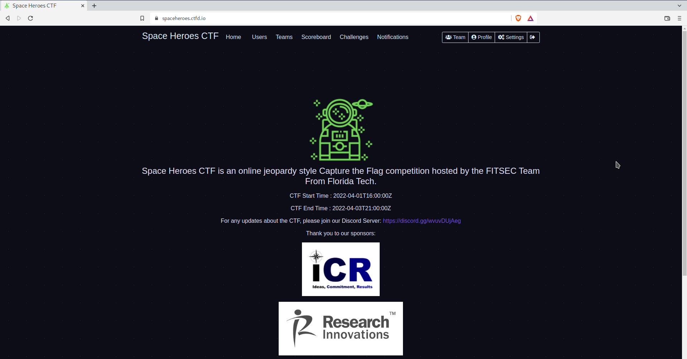

# Space Heroes CTF

## About this Event
Space Heroes CTF is an online jeopardy style Capture the Flag competition hosted by the FITSEC Team From Florida Tech. Challenges at all levels of difficulty (beginner to expert) for pwn, RE, crypto, web, and forensics.

CTF Start Time : 2022-04-01T16:00:00Z

CTF End Time : 2022-04-03T21:00:00Z

Official URL: http://spaceheroes.ctfd.io/

Event Record: [CTF Time](https://ctftime.org/event/1567)

## Score

| Place | CTF points |
|-------|------------|
|180    |  1300      |

## Challenges 
| Name | Points | Tags | Writeups |
|------|--------|------|----------|
|CapeKennedy|	100|re|[CapeKennedy/README.md](CapeKennedy/README.md)|
|Curious?|||[Curious/README.md](Curious/README.md)|
|FlagInSpace|||[FlagInSpace/README.md](FlagInSpace/README.md)|
|GuardiansOfTheGalaxy|||[GuardiansOfTheGalaxy/README.md](GuardiansOfTheGalaxy/README.md)|
|Launched|||[Launched/README.md](Launched/README.md)|
|MysteriousBroadcast|||[MysteriousBroadcast/README.md](MysteriousBroadcast/README.md)|
|NetflixAndCTF|||[NetflixAndCTF/README.md](NetflixAndCTF/README.md)|
|R2D2|||[R2D2/README.md](R2D2/README.md)|
|SpaceBuds|||[SpaceBuds/README.md](SpaceBuds/README.md)|
|SpaceTraveler|||[SpaceTraveler/README.md](SpaceTraveler/README.md)|
|Starman|||[Starman/README.md](Starman/README.md)|

## Screenshots

