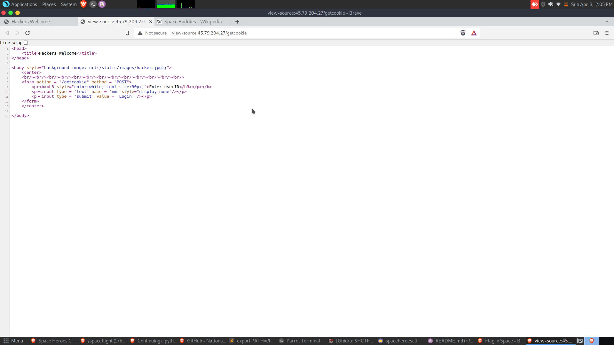

# Space Buds

## The Problem

Points: 100

Rating: Medium

Author: Lil Tipo

Flavor Text:
```

One of the puppies got into the web server. Can you help find out who it was?

```

Attachments : [45.79.204.27]()


## Solution

lets pull up the site


and check the source




thinking we need to post the form with the correct dogs name. 

I played with it for a few altering the input so its visible and posting the pups names. didnt get it done

i dont know this movie so I pulled up a cast list:


```
B-Dawg
Buddha
Rosebud
Mudbud ...
```


I looked deeper into the web request and ahhah we have cookies


tried to alter the page and save a copy without the hidden flag on the nm field so I could post the puppies names found on the wikipedia entry for cast. this didn't work

reviewed the site and found cookies and a posting form.


wrote a golang [solve.go](solve.go) script to post the form and include a cookie with the name included for extra measure(not sure if both are needed).

```
 package main

 import (
 	"fmt"
 	"net/http"
 	"os"
 	"log"
    "strings"
    "io/ioutil"
 )

 func main() {
 	username := os.Args[1]

 	
 	cookie := &http.Cookie{
        Name:   "userID",
        Value:  username,
        MaxAge: 300,
    }
    
    req, err := http.NewRequest("POST", "http://45.79.204.27/getcookie", strings.NewReader("nm="+username))
    if err != nil {
        log.Fatalf("Got error %s", err.Error())
    }
    req.Header.Set("Content-Type", "application/json; charset=UTF-8")
    req.AddCookie(cookie)
    
    for _, c := range req.Cookies() {
        fmt.Println(c)
    }
    client := &http.Client{}
    resp, err := client.Do(req)
    if err != nil {
        log.Fatalf("Error occured. Error is: %s", err.Error())
    }
    defer resp.Body.Close()
	fmt.Println("response Status:", resp.Status)
	fmt.Println("response Headers:", resp.Header)
	body, _ := ioutil.ReadAll(resp.Body)
	fmt.Println("response Body:", string(body))
 }

```

found a real response  
```


run solve.go <enter puppy here>

and run solve.go Mudbud finally does something new and returns :

```


## Flag

lets check out /static/images/spacecookie.jpg


and after some eye strain and zooming we have:

```
shctf{tastes_like_raspberries}
```

## Final Notes
funny and always love a quick solve script.


