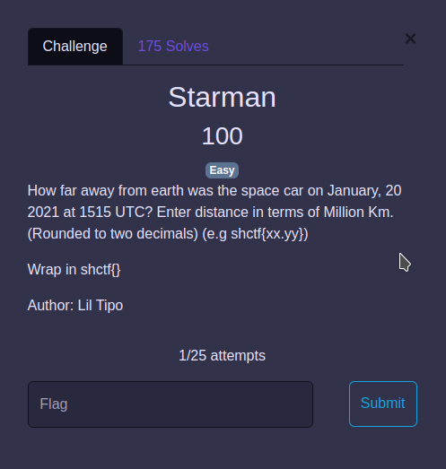
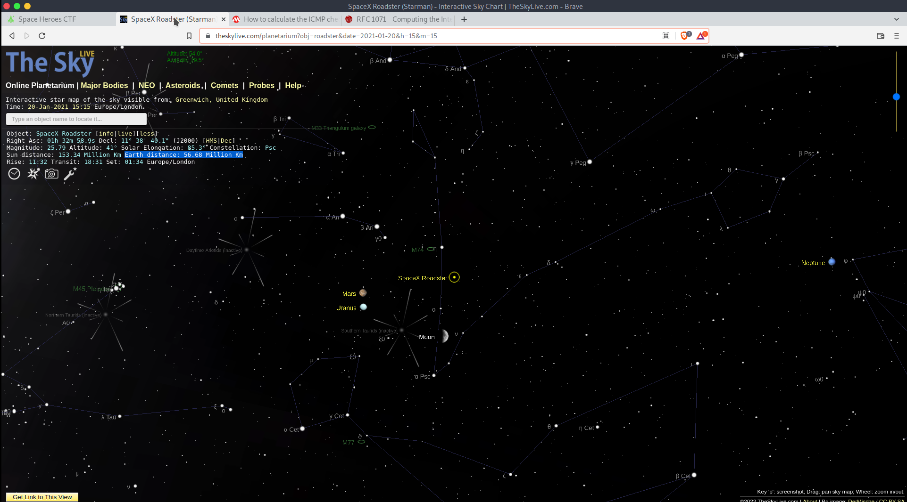
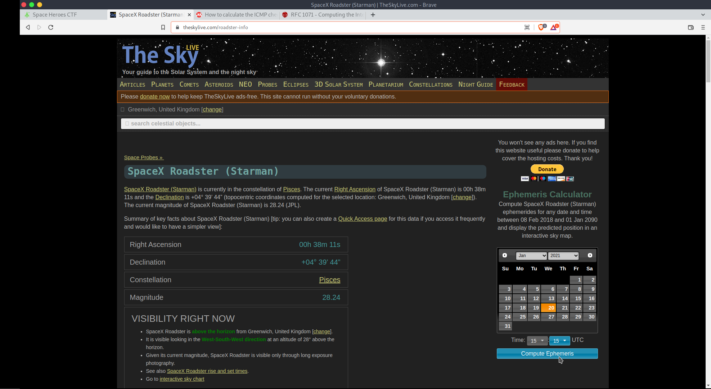

# Starman

## The Problem

Points: 100

Rating: Easy


Author: Lil Tipo

Flavor Text:
```

How far away from earth was the space car on January, 20 2021 at 1515 UTC? Enter distance in terms of Million Km. (Rounded to two decimals) (e.g shctf{xx.yy})

Wrap in shctf{}


```

Attachments : []()



## Solution

Searched for starman tracker space car


took a few tries to find a tracker with a calculator that lets you set the date and time




Earth distance: 56.68 Million Km



## Flag
```
shctf{56.68}
```

## Final Notes


