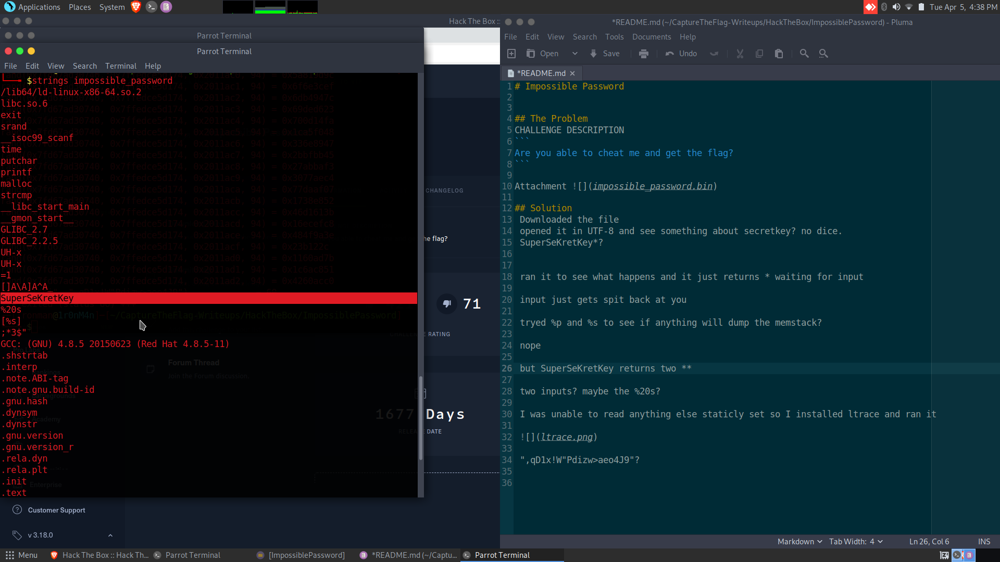
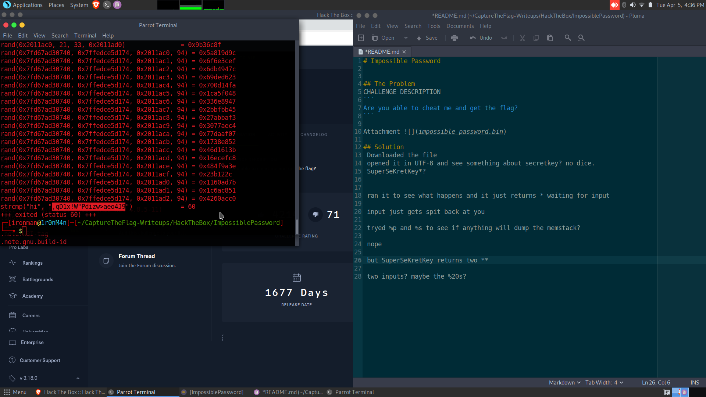

# Impossible Password


## The Problem
CHALLENGE DESCRIPTION
```
Are you able to cheat me and get the flag?
```

Attachment 

## Solution
 Downloaded the file
 opened it in UTF-8 and see something about secretkey? no dice. 
 SuperSeKretKey*?
 
 
 ran it to see what happens and it just returns * waiting for input
 
 input just gets spit back at you
 
 tryed %p and %s to see if anything will dump the memstack?
 
 nope
 
 but SuperSeKretKey returns two **
 
 
 two inputs? maybe the %20s?
 
 I was unable to read anything else staticly set so I installed ltrace and ran it
 
 
 
 ",qD1x!W"Pdizw>aeo4J9"?
 herm nope :(
 
 
 the compare seems to only be against a random value? set from what? 
 
 dug into what happens next as beating the random gen is not really feasible. 
 the next function seems to print the flag to stout using the 20 variables that follow the plaintext password var
 
 those all get printed one my one ^9 as a simple shift cypher. i played in a c++ simulator to work out how the function worked and eventually broke it down to simply printing the variables in order to result in the flag:
 ```
 
 ```
 
 
 ```
 HTB{40b949f92b86b18}
 ```
 
